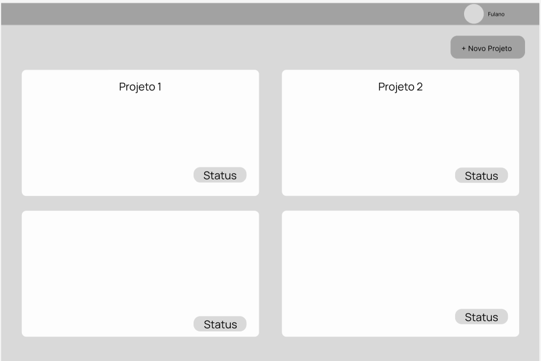
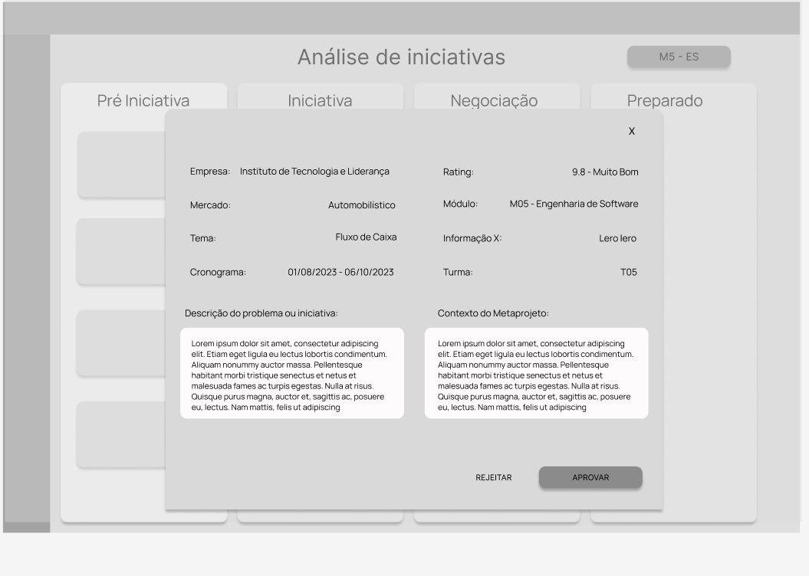
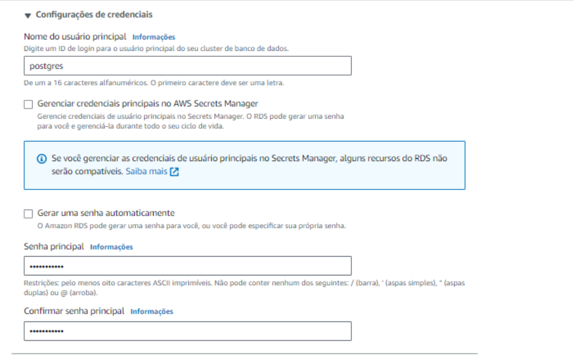
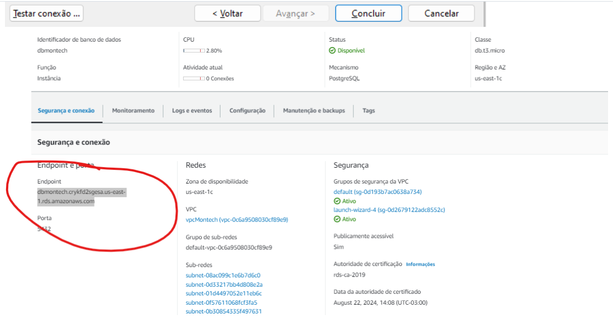

#  Instituto de Tecnologia e Liderança

# Kondo

## Montech

## :student: Integrantes:

- <a href="https://www.linkedin.com/in/eduarda-gonzaga-009794219/">Eduarda Gonzaga</a>

- <a href="https://www.linkedin.com/in/joao-victor-montagna-4bb3a4247/">João Montagna</a>
- <a href="https://www.linkedin.com/in/luiscmiranda/">Luis Miranda</a>
- <a href="https://www.linkedin.com/in/mauricio-felicissimo-475024240/">Mauricio Felicissimo</a>
- <a href="https://www.linkedin.com/in/renan-ribeiro-31a205247/">Renan Ribeiro</a>
- <a href="https://www.linkedin.com/in/yuri-toledo-964123230/">Yuri Toledo</a>

## :teacher: Professores:

### Orientador(a)

- <a href="https://www.linkedin.com/in/vanunes/">Vanessa Nunes</a>

### Instrutores

- <a href="https://www.linkedin.com/in/jose-romualdo/">Programação - José Romualdo</a>
- <a href="https://www.linkedin.com/in/geraldo-magela-severino-vasconcelos-22b1b220/">Matemática e Física - Geraldo Vasconcelos</a>
- <a href="https://www.linkedin.com/in/lisane-valdo/">Negócios - Lisane Valdo</a>
- <a href="hhttps://www.linkedin.com/in/gui-cestari/">Design - Guilherme Henrique de Oliveira Cestari</a>
- <a href="https://www.linkedin.com/in/filipe-gon%C3%A7alves-08a55015b/">Liderança - Filipe Gonçalves</a>

## Conteúdo

**[1. Visão Geral do Projeto](#1-visão-geral-do-projeto)**

- [1.1. Parceiro de Negócios](#11-parceiro-de-negócios)
  - [1.1.1. Partes Interessadas](#111-partes-interessadas)
  - [1.1.2. Análise da Indústria](#112-análise-da-indústria)
- [1.2. Problema](#12-problema)
  - [1.2.1. Análise do Problema](#121-análise-do-problema)
  - [1.2.2 Análise do cenário: Matriz SWOT](#122-análise-do-cenário-matriz-swot)
- [1.3. Descritivo da Solução](#13-descritivo-da-solução)
  - [1.3.1. Objetivos](#131-objetivos)
  - [1.3.2. Proposta de Valor: Value Proposition Canvas](#132-proposta-de-valor-value-proposition-canvas)
  - [1.3.3. Matriz de Risco](#133-matriz-de-risco)
- [1.4. Proposta Tecnológica e Benefícios](#14-proposta-tecnológica-e-benefícios)
  - [1.4.1. Tipo de arquitetura de nuvem escolhida](#141-tipo-de-arquitetura-de-nuvem-escolhida)
  - [1.4.2. Arquitetura de nuvem escolhida](#142-arquitetura-de-nuvem-escolhida)
  - [1.4.3. Benefícios trazidos pela arquitetura de nuvem proposta](#143-benefícios-trazidos-pela-arquitetura-de-nuvem-proposta)

**[2. Entendimento da Experiência do Usuário](#2-entendimento-da-experiência-do-usuário)**

- [2.1. Perfis de Usuários](#21-perfis-de-usuários)
  - [2.1.1. Personas](#211-personas)
- [2.2. Mapa de Jornada do Usuário](#22-mapa-de-jornada-do-usuário)
- [2.3. Wireframes](#23-wireframes)

**[3. Requisitos](#3-requisitos)**

- [3.1. Requisitos Funcionais](#31-requisitos-funcionais)
  - [3.1.1. Casos de Uso](#311-casos-de-uso)
  - [3.1.2. User Stories](#312-user-stories)
- [3.2. Requisitos não Funcionais](#32-requisitos-não-funcionais)

**[4. Arquitetura do Sistema](#4-arquitetura-do-sistema)**

- [4.1. Diagrama de Arquitetura](#41-diagrama-de-arquitetura)
- [4.2. Diagrama de Implantação](#42-diagrama-de-implantação)
  - [4.2.1. Procedimentos de implantação da solução](#421-componentes-que-compões-a-solução)
  - [4.2.2. Procedimentos de implantação da solução](#422-procedimentos-de-implantação-da-solução)
- [4.3. Diagrama de Sequência](#43-diagrama-de-sequência)
- [4.4 Procedimento de implacação em nuvem](#44-cloud)

**[5. Projeto e Implementação UX e UI](#5-projeto-e-implementação-ux-e-ui)**
- [5.1. Frontend](#51-frontend)

**[6. Backend](6-backend)**

**[7. Projeto de Banco de Dados](#7-projeto-de-banco-de-dados)**
- [7.1. Modelo Conceitual](#71-modelo-conceitual)
- [7.2. Modelo Lógico](#72-modelo-lógico)

**[8. Testes de Software](#8-testes-de-software)**
- [8.1 Teste de Usabilidade](#81-testes-de-usabilidade)
- [8.2 Teste Automatizados](#82-testes-automatizados)
- [8.3 Teste de Requisitos Não Funcionais](#83-teste-de-RNF)
- [8.4 Refatoração de Testes](#8-refatoração-de-testes)
  - [8.4.1 Sprint 1](#841-sprint1)
  - [8.4.2 Sprint 2](#842-sprint2)
  - [8.4.3 Sprint 3](#843-sprint3)

**[9. Documentação da API](#9-documentação-da-api)**

**[Referências](#referências)**

**[Apêndice](#apêndice)**

# 1. Visão Geral do Projeto

## 1.1 Parceiro de Negócios

Fundado em 2020, o **Inteli (Instituto de Tecnologia e Liderança)** é uma instituição de Ensino Superior privada brasileira, sem fins lucrativos, localizada em São Paulo, focada nas áreas de tecnologia, engenharia, negócios e liderança. Portanto, focaremos essa análise na indústria de Ensino Superior no Brasil.

## Principais Competidores

Principais competidores: Dentre os competidores diretos, podemos citar instituições de Ensino Superior públicas e privadas que oferecem cursos em tecnologia/engenharia - exemplos no Estado de São Paulo são a USP (Universidade de São Paulo), Unicamp (Universidade de Campinas), Insper (Instituto de Ensino e Pesquisa), ITA (Instituto Tecnológico de Aeronáutica) e FIAP (Faculdade de Informática e Administração). Indiretamente, podemos citar também cursos livres e bootcamps, principalmente no caso de alunos que já possuem uma formação e querem se requalificar.

## Modelo de Negócio

Modelo de negócio no contexto da indústria: No mercado de Ensino Superior no Brasil, várias instituições, tanto públicas quanto privadas, oferecem cursos de graduação. Essas instituições geralmente geram receita por meio do pagamento de mensalidades pelos estudantes e seus responsáveis, além de doações de bolsas e taxas de inscrição do vestibular. Os custos e despesas incluem a construção e manutenção da infraestrutura física e digital de ensino, bem como a folha de pagamento do corpo docente e demais funcionários. Um fator essencial para a saúde do negócio é o contínuo interesse de novos candidatos, além da retenção dos alunos existentes.

## Tendências de Mercado

Tendências de mercado: O mercado de Ensino Superior no Brasil vem crescendo nas últimas décadas, principalmente com o crescimento de grandes grupos educacionais privados, muitos com fins lucrativos, que também aumentam a concentração no mercado. Uma das tendências deste mercado é a oferta de cursos no formato híbrido e virtual, com a expansão de polos EAD pelo país. Em termos de ensino em tecnologia, também observa-se o surgimento de novos cursos de graduação e pós-graduação, em áreas como Data Science e Big Data/AI, que não existiam anos atrás. Algumas instituições, como o Inteli, têm também começado a adotar formatos atualizados de ensino, como o PBL (Problem-based Learning).

### 1.1.1 Partes Interessadas

Descreva os principais stakeholders envolvidos no projeto e seus papéis.

**1. Alunos**:

Os alunos são os principais beneficiários do projeto. Eles buscam adquirir conhecimentos, habilidades e experiências por meio da metodologia de ensino oferecida pelo Inteli.

**2. Escritório de Projetos**:

A equipe do Escritório de Projetos do Inteli é responsável por planejar, desenvolver e implementar os projetos que serão desenvolvidos em cada módulo do curso.

### 1.1.2 Análise da Indústria

**As 5 Forças de Porter**

As 5 Forças de Porter é o nome dado para um modelo criado por Michael Porter visando entender as forças do mercado que influenciam no desempenho de uma empresa. A seguir, uma análise do Inteli (Instituto de Tecnologia e Liderança) seguindo o modelo de Porter:

**Rivalidade entre os concorrentes existentes**:

O Inteli surge em um mercado educacional já existente, competindo com universidades tradicionais, cursos online de tecnologia e outras instituições inovadoras. A USP (Universidade de São Paulo), Insper (Instituto de Ensino e Pesquisa) e ITA (Instituto Tecnológico de Aeronáutica), são alguns dos seus concorrentes. A competição é baseada principalmente em relação ao nome da faculdade para o mercado de trabalho, qualidade do ensino e mensalidade. No entanto, o Inteli se diferencia ao oferecer uma abordagem única de ensino baseado em projetos, integrando competências comportamentais e negócios com a tecnologia. Isso lhe confere uma vantagem competitiva, pois a abordagem diferenciada pode atrair alunos em busca de uma formação mais abrangente e prática.

**Ameaça de novos entrantes**:

Embora o mercado educacional possa ser acessível a novos entrantes, a presença da família Esteves e o apoio do banco BTG Pactual conferem ao Inteli uma base sólida, tendo em vista a reputação e os recursos financeiros desses e outros patrocinadores. Além disso, a proposta de valor única do Inteli, com foco em projetos e competências multidisciplinares, também pode dificultar a entrada de novos concorrentes diretos.

**Ameaça de produtos ou serviços substitutos**:

Considerando o foco do Inteli na formação de líderes em tecnologia com habilidades de negócios e competências comportamentais, a ameaça de substitutos diretos é relativamente baixa. No entanto, a rápida evolução da educação online e outras formas de aprendizado contínuo podem tornar-se substitutos indiretos. Sendo assim, o Inteli deve sempre inovar e aumentar suas ofertas de serviços educacionais para estas mudanças no mercado.

**Poder de barganha dos fornecedores**:

Os fornecedores do Inteli incluem professores, orientadores, psicopedagogos, especialistas em tecnologia, profissionais de negócios que contribuirão para a instrução e desenvolvimento dos alunos, entre outros. Dado o alto nível de especialização necessário, esses fornecedores podem ter um certo poder de barganha. No entanto, a proposta e os recursos do Inteli podem atrair talentos qualificados e tornar mais acessível o poder de barganha dos fornecedores.

**Poder de barganha dos compradores (alunos)**:

O poder de barganha dos alunos pode variar, uma vez que dispõem de várias alternativas educacionais à escolha. No entanto, o Inteli apresenta uma proposta de valor singular, destacando competências tangíveis e traços comportamentais, juntamente com a criação de laços no mercado, interagindo com diversas empresas ao longo de cada módulo até a graduação. Isso pode reduzir o poder de barganha dos alunos que buscam uma formação mais abrangente e alinhada com as demandas do setor. Importante mencionar que o Inteli oferece um amplo leque de bolsas de estudo destinadas a estudantes que enfrentam restrições financeiras para custear mensalidades, alojamento, alimentação, entre outros.

## 1.2 Problema

### 1.2.1 Análise do Problema

O problema apresentado pelo Inteli, reside na ausência de uma plataforma eficaz para a gestão de parcerias entre empresas e estudantes em projetos conjuntos baseados no modelo de Aprendizagem Baseada em Problemas (PBL). Atualmente, a organização, acompanhamento e distribuição de projetos propostos aos módulos abertos no trimestre são feitas de forma manual, utilizando planilhas no Excel. Esse processo se tornou inadequado devido à diversidade de matérias e ao aumento no número de turmas em aberto.

### 1.2.2 Análise do cenário: Matriz SWOT

A análise SWOT é uma ferramenta de planejamento estratégico usada para avaliar a situação de um negócio, projeto ou organização. O termo "SWOT" é um acrônimo das palavras em inglês: Strengths (Forças), Weaknesses (Fraquezas), Opportunities (Oportunidades) e Threats (Ameaças). Ennvolvendo a avaliação interna e externa de um contexto para identificar fatores que podem afetar positiva ou negativamente o sucesso daquilo que está sendo analisado.

## 1.3 Descritivo da Solução

### 1.3.1 Objetivos

Atualmente fazemos parte de uma instituição que tem como parte do processo de ensino fazer uma parceria com alguma empresa que está com algum problema ou dificuldade , sendo assim a INTELI tem como objetivo pegar esse problema e decidir em qual das grades ela se encaixa. O parceiro da vez é a própria instituição INTELI, que atualmente está com dificuldades justamente nesse processo. A INTELI acaba depositando muito esforço na hora de analisar a dor do parceiro e decidir em qual das 36 grades ela se encaixa, tendo que manualmente avaliar a descrição do problema do parceiro e decidir qual grade seria a melhor para encaixar tal dor. Para conseguir resolver ou amenizar a dor da INTELI nesse quesito, iremos realizar um site em nuvem AWZ no qual ele irá coletar a dor detalhada do parceiro em arquivo para que nosso sistema possa analisá-la com um modelo preditivo e sugerir as grades que mais se encaixam a ela. Sendo assim, não pretendemos usar do método de automatizar e sim aumentar, auxiliando muito na hora de analisar e decidir qual grade atrelar a dor.

### 1.3.2 Proposta de Valor: Value Proposition Canvas

O Value Proposition Canvas é uma ferramenta utilizada no desenvolvimento de produtos ou serviços para visualizar e compreender como a proposta de valor de um produto se alinha com as necessidades e desejos dos clientes.

### 1.3.3 Matriz de Risco

A Matriz de Riscos, também conhecida como Matriz de Probabilidade e Impacto, é uma ferramenta usada na gestão de projetos e planejamento estratégico para avaliar os riscos associados a diferentes cenários e tomar medidas para mitigá-los.

1. Risco 001: Problema de acesso a internet.
   - Impacto: Baixo
   - Risco: Alto
   - Descrição: Este risco apresenta a possibilidade de enfrentar dificuldades no acesso à internet durante a execução do projeto. Embora o impacto seja baixo em termos de danos potenciais, o risco é alto porque a conectividade à internet é essencial para muitas operações e pode causar interrupções significativas se não estiver disponível. Isso pode acontecer devido a algum erro na rede, como a queda da internet ou algo similar.

2. Risco 002: Complexidade tecnológica.
   - Impacto: Médio
   - Risco: Médio
   - Descrição: Este risco envolve a complexidade tecnológica associada ao projeto. O impacto é considerado moderado, pois a complexidade pode aumentar custos e prazos, mas o risco é médio, pois pode ser gerenciado com a expertise técnica adequada.

3. Risco 003: Escassez de parceiros.
   - Impacto: Baixo
   - Risco: Baixo
   - Descrição: Neste risco, considera-se a possibilidade de não conseguir encontrar parceiros em número suficiente para apoiar o projeto. Tanto o impacto quanto o risco são baixos, indicando que a falta de parceiros não é uma grande preocupação.

4. Risco 004: Falta de clareza no UX (Experiência do Usuário).
   - Impacto: Médio
   - Risco: Alto
   - Descrição: Este risco se relaciona com a possibilidade de o projeto não apresentar uma experiência de usuário clara. Embora o impacto seja moderado, o risco é alto, pois a falta de clareza na UX pode afetar a usabilidade e a aceitação do projeto.

5. Risco 005: Entrega de resultados incoerentes.
   - Impacto: Alto
   - Risco: Alto
   - Descrição: Este risco envolve a possibilidade de entregar resultados inconsistentes ou de baixa qualidade. Devido ao impacto significativo que isso pode ter nos objetivos do projeto, é considerado um risco alto que requer atenção especial.

6. Risco 006: Segurança dos dados de usuário.
   - Impacto: Médio
   - Risco: Alto
   - Descrição: Este risco refere-se à segurança dos dados dos usuários do projeto. Embora o impacto seja moderado, o risco é alto, pois qualquer violação de segurança pode comprometer a confiança dos usuários e resultar em sérias consequências legais e reputacionais.

7. Risco 007: Falta de informações dos parceiros.
   - Impacto: Baixo
   - Risco: Médio
   - Descrição: Neste risco, considera-se a possibilidade de não receber informações adequadas dos parceiros de projeto. Embora o impacto seja baixo, o risco é médio, pois a falta de informações dos parceiros pode afetar a colaboração e a qualidade do MVP em sua elaboração inicial.

8. Risco 008: Atraso na entrega de componentes.
   - Impacto: Baixo
   - Risco: Baixo
   - Descrição: Este risco diz respeito à possibilidade de atrasos na entrega de componentes necessários para o projeto. Tanto o impacto quanto o risco são baixos, sugerindo que esse risco é gerenciável e tem um potencial limitado de causar danos.

9. Risco 009: Resistência à mudança.
   - Impacto: Médio
   - Risco: Baixo
   - Descrição: Este risco envolve a resistência das partes interessadas em aceitar mudanças no projeto. Embora o impacto seja moderado, o risco é baixo, indicando que a resistência pode ser superada com estratégias adequadas de gerenciamento de mudanças.

Oportunidades:

1. Oportunidade 001: Eficácia da equipe. 
- Impacto: alto
- Oportunidade: alta
 - Descrição: Esta oportunidade representa a possibilidade de melhorar significativamente a eficácia da equipe envolvida no projeto. O impacto é alto, pois uma equipe mais eficaz pode acelerar a execução do projeto e melhorar a qualidade do trabalho. A oportunidade também é alta, sugerindo que é uma meta viável  a ser perseguida.

2. Oportunidade 002: Participação em Eventos 
- Impacto: médio
- Oportunidade: média
- Descrição: Esta oportunidade diz respeito à participação em eventos relevantes para o projeto. Embora o impacto não seja extremamente alto, a oportunidade é considerada média, o que significa que participar de eventos pode proporcionar benefícios moderados, como networking e visibilidade.

3. Oportunidade 003: Reconhecimento da Instituição 
- Impacto: alto
- Oportunidade: baixa 
- Descrição: Aqui, a oportunidade está relacionada ao aumento do reconhecimento da instituição envolvida no projeto. Embora o impacto seja alto, indicando que isso pode trazer benefícios significativos, a oportunidade é baixa, sugerindo que pode ser um desafio alcançar esse reconhecimento.

4. Oportunidade 004: Eficácia na organização dos projetos 
- Impacto: alto
- Oportunidade: média
- Descrição: Essa oportunidade envolve aprimorar a eficácia na organização dos projetos. Com um impacto alto, melhorar a gestão de projetos pode levar a resultados mais positivos. A oportunidade é considerada média, o que significa que é uma meta que vale a pena, mas pode exigir esforços substanciais.

5. Oportunidade 005: Aprendizado dos alunos 
- Impacto: médio 
- Oportunidade: média
- Descrição: Esta oportunidade se concentra em melhorar o aprendizado dos alunos envolvidos no projeto. O impacto é considerado médio, o que significa que melhorar o aprendizado pode trazer benefícios, embora não sejam extremamente altos. A oportunidade também é média, indicando que é uma meta alcançável.

6. Oportunidade 006: Atração de novos alunos 
- Impacto: médio
- Oportunidade: baixa 
- Descrição: Aqui, a oportunidade está relacionada à atração de novos alunos para a instituição. Embora o impacto seja médio, a oportunidade é baixa, sugerindo que atrair novos alunos pode ser desafiador devido à concorrência ou outros fatores.

7. Oportunidade 007: Melhoria na experiência do parceiro 
- Impacto: baixo
- Oportunidade: alta
- Descrição: Esta oportunidade envolve a melhoria da experiência dos parceiros envolvidos no projeto. O impacto é baixo, mas a oportunidade é alta, o que indica que focar na satisfação dos parceiros pode trazer benefícios substanciais a longo prazo, como relações comerciais mais sólidas.

8. Oportunidade 008: Feedback de usuários 
- Impacto: baixo
- Oportunidade: média
- Descrição: Nesta oportunidade, busca-se obter feedback dos usuários do projeto. O impacto é baixo, mas a oportunidade é média, indicando que a coleta de feedback pode não ter um grande impacto imediato, mas é uma prática valiosa para melhorias contínuas.

9. Oportunidade 009: Desenvolvimento tecnológico 
- Impacto: baixo 
- Oportunidade: baixa
- Descrição: Esta oportunidade se refere ao desenvolvimento tecnológico relacionado ao projeto. Tanto o impacto quanto a oportunidade são baixos, sugerindo que o foco nessa área pode não ter um grande impacto no projeto ou que pode ser difícil de realizar devido a limitações existentes.

## 1.4 Proposta Tecnológica e Benefícios

### 1.4.1 Tipo de arquitetura de nuvem escolhida

A arquitetura típica em nuvem pública da AWS (Amazon Web Services) envolve vários serviços interconectados para hospedar e executar aplicativos de forma escalável e confiável. Vamos descrever a arquitetura e suas relações entre um EC2 (Elastic Compute Cloud), RDS (Relational Database Service) e VPC (Virtual Private Cloud) na AWS.

### 1.4.2 Arquitetura de nuvem escolhida

EC2 (Elastic Compute Cloud):
Os EC2 são instâncias de máquinas virtuais escaláveis na nuvem da AWS. Eles atuam como servidores virtuais onde os aplicativos podem ser implantados.

RDS (Relational Database Service):
O RDS é um serviço gerenciado de banco de dados relacional na nuvem da AWS. Ele oferece suporte a diversos tipos de bancos de dados, como MySQL, PostgreSQL, Oracle, SQL Server, entre outros.
O RDS simplifica a administração do banco de dados, gerenciando tarefas como backup, replicação e escalabilidade.

VPC (Virtual Private Cloud):
A VPC é uma rede isolada virtualmente que permite criar e configurar a topologia de rede para suas instâncias EC2 e outros recursos da AWS.
Ela fornece controle total sobre a rede, permitindo a criação de sub-redes privadas e públicas, o uso de grupos de segurança para controlar o tráfego e a configuração de regras de firewall.

### 1.4.3 Benefícios trazidos pela arquitetura de nuvem proposta

Benefícios de uma aplicação hospedada em cloud (nuvem pública), como na AWS:
Elasticidade: A capacidade de escalar recursos automaticamente sob demanda, garantindo que a aplicação tenha desempenho adequado em momentos de tráfego elevado e economizando custos em momentos de menor uso.
Alta Disponibilidade: A arquitetura em nuvem permite distribuir aplicativos em várias Zonas de Disponibilidade (AZs), garantindo alta disponibilidade e tolerância a falhas.
Gerenciamento Simplificado: Serviços gerenciados, como o RDS, reduzem a carga de trabalho operacional, automatizando tarefas como backup, recuperação de desastres e escalabilidade.
Segurança Avançada: As nuvens públicas oferecem recursos de segurança avançados, como grupos de segurança, políticas de acesso e monitoramento de tráfego, ajudando a proteger os aplicativos contra ameaças.
Acesso Global: Acesso rápido a recursos em qualquer lugar do mundo, permitindo a expansão global de aplicativos.

# 2. Entendimento da Experiência do Usuário

 O entendimento do usuário é essencial para criar produtos e serviços que atendam às necessidades do mercado, promovam a satisfação do cliente e impulsionem o sucesso de negócios e projetos em diversas áreas. É uma abordagem que coloca o usuário no centro do processo de tomada de decisão, resultando em melhores resultados e maior relevância no mercado. 

## 2.1. Perfis de Usuários

É fundamental em diversos campos, como design e  desenvolvimento de software. Trata-se de uma abordagem que visa compreender as necessidades, expectativas, preferências e comportamentos dos usuários da aplicação.

### 2.1.1 Personas

Personas são representações de usuários que são criadas para ajudar equipes de design e desenvolvimento a compreenderem melhor as necessidades, desejos, comportamentos e características dos seus públicos-alvo.

## 2.2 Mapa de Jornada do Usuário

## 2.3 Wireframes

wireframe é um esboço visual básico e esquemático de um projeto, como um site, aplicativo ou interface de usuário. Ele representa a estrutura e o layout dos elementos principais da interface sem se preocupar com detalhes de design, cores ou conteúdo real. Os wireframes são criados no início do processo de design para visualizar e comunicar a disposição geral dos elementos e a funcionalidade do projeto. É possível ser visualizado, atráves do link: 
Para atender o escopo do projeto, a aplicação se segmenta em dois fluxos, sendo eles:

* **Organização Interessada**
Assim é possível ter os dados de informações e de contato.

**Login** Quando uma organização realizou o cadastro anteriormente, é possível acessar a aplicação pelo Login

A primeira tela quando uma organização acessa a aplicação, sendo possível visualizar as iniciativas enivadas

Tela quando uma organização acessa o botão "+ Novo Projeto" para cadastrar uma nova iniciativa.

* **Escritório de Projetos**

Tela inicial de visualização do Escritório de projetos, podendo ver alterar o status de uma iniciativa 

Esse é o modal para acessar mais informações de uma iniciativa e "aceitar" para que após a negociação, seja um metaprojeto.

Tela para alocação de projetos em uma turma, selecionado pelo módulo.

# 3. Requisitos

Um requisito é uma especificação que define as necessidades e condições que o sistema deve atender.

## 3.1 Requisitos Funcionais

Requisitos Funcionais são todos os problemas e necessidades que devem ser atendidos e resolvidos pelo software por meio de funções ou serviços. Para esta análise inicial, trouxemos 3 requisitos, sendo eles:

**RF01. Compatibilidade dos Projetos**

**Descrição**: assegurar a compatibilidade entre os projetos propostos pelas empresas e os módulos abertos, considerando tanto as competências necessárias para os projetos quanto as disciplinas disponíveis. Isso possibilita uma otimização aprimorada, garantindo que os projetos empresariais estejam alinhados com as competências existentes no sistema, aumentando assim a eficácia e o sucesso dos projetos.

**Informações**:

-A análise é realizada para garantir a compatibilidade entre projetos empresariais e módulos abertos.

-São consideradas as competências exigidas pelos projetos e as disciplinas disponíveis no sistema.

**Aplicação**:

-Um projeto proposto por uma empresa para modelo preditivo com programação em Python e análise de dados.

-A análise de compatibilidade identifica as disciplinas relacionadas a Python e análise de dados na página do EP.

-Caso haja uma correspondência satisfatória entre as competências e as disciplinas disponíveis, o projeto é considerado compatível. Para isso, podemos desenvolver uma integração com o chat GPT na parte de IA para corresponder uma proposta de projeto com um módulo em aberto. Isso pode ser visualizado no formato de dashboard dentro da plataforma.

**RF02. Atualização do Status de Módulos no Trimestre/Semestre**

**Descrição**: divulgação de informações referentes aos módulos disponíveis no trimestre/semestre. Essas informações incluem detalhes sobre os tópicos que serão abordados e estudados pelos alunos ao longo do período.

**Informações**:

-O sistema deve fornecer informações sobre os módulos disponíveis no trimestre/semestre.

-As informações devem abranger os assuntos que serão ensinados durante o período.

**Aplicação**:

-No início do semestre, as empresas acessam o sistema para obter informações sobre os módulos oferecidos que estão disponiveis para realização de projeto.

-Cada módulo listado apresenta uma descrição detalhada dos tópicos que serão abordados.

-As empresas podem tomar decisões com base nessas informações, selecionando módulos que se alinhem com seus interesses e objetivos.

### 3.1.1 Casos de Uso

O diagrama de caso de uso é uma ferramenta para a engenharia de requisitos e análise de sistemas, servindo para demonstrar de uma forma mais visual a interação entre os usuários e o sistema em desenvolvimento. Com a utilização de diagramas comportamentais permite uma maior compreensão dos requisitos e definição do escopo.

Para melhor compreensão das interações presente no sistema, definimos dois fluxos: EP (escritório de projetos) e OI (organização interessada).

**EP - (Escritório de Projetos):**
1 - "Editar o escopo de módulos". É importante para o inteli, como instituição de tecnologia, estar atualizado conforme as modificações do mercado. Para isso, é necessário atender o demanda com atualizações no escopo dos módulos.

2 - "Aprovar pré-iniciativas". Assim que uma organização interessada submete uma proposta para a iniciativa de um metaprojeto, é necessário que o escritório de projetos avalie e aprove a iniciativa para ser levada como possibilidade de um parceiro.

3 - "Ver iniciativas para cada módulo". Quando uma organização interessada é aprovada em todas as etapas, o escritório de projetos consegue visualizar todas as iniciativas de parceiros que se encaixam em algum módulo específico.

4 - "Acompanhar o andamento das etapas do possíveis projetos" Para que uma organização se torne um parceiro, algumas etapas são necessárias como a aprovação de iniciativa, negociação dos termos e outros, assim o escritório de projetos consegue visualizar o andamento das iniciativas em cada etapa. (Possível verificar no wireframe).

5 - "Alocação de metaprojetos por turma" Em um dashboard, o escritório de projetos, consegue ter a visão macro das turmas e como está a alocação de projetos durante os 4 módulos do ano. Podendo assim, alocar metaprojetos em algum módulo de uma turma específica.

6 - "Visualizar o andamento de cada proposta para aquele determinado módulo" para isso deve "filtrar o módulo". Com o objetivo de ter uma visão de módulo e não apenas de turma, é possível ver as etapas para cada iniciativa filtrando por um módulo específico, visando que diversas turmas faram o mesmo módulo mas com iniciativas (futuros parceiros) diferentes.

**OI - (Organização Intressada):**
1- "Fazer cadastro de uma organização e um responsável para contato" Para o inteli ter uma organização como parceira, essas organização faram o cadastro respondendo um formulário para que o inteli consiga entrar em contato com uma pessoa responsável.

2- "Visualizar projetos já enviados e seus respectivos status" Algumas empresas e organizações, fazem diversos projetos com o inteli, visando isso, a empresa teria a visão do andamento de cada projeto enviado.

3 - "Enviar proposta para análise" Assim é possível que a empresa envie uma proposta, ou seja, uma pré iniciativa que vai estar em análise do escritório de projetos.

### 3.1.2 User Stories

**EP - (Escritório de Projetos):**
    Eu, como analista do  escritório de projetos, quero editar o escopo de módulo, para atualizar quando necessário para o corpo docente.

    Eu, como analista do  escritório de projetos, quero aprovar as iniciativas.

    Eu, como analista do  escritório de projetos, quero ver as iniciativas para cada um dos módulos.

    Eu, como analista do  escritório de projetos, quero acompanhar o andamento das etapas dos projetos para saber o que é necessário no processo de negociação.

    Eu, como analista do  escritório de projetos, quero alocar um projeto para um módulo de uma turma específica.

    Eu, como analista do escritório de projetos, quero visualizar o andamento de cada proposta para um determinado módulo.

**OI - (Organização Intressada):**
    Eu, como organização interessada, quero fazer meu cadastro, para ter meios de contato.

    Eu, como organização interessada quero visualizar os projetos já enviados e seus respectivos status, afim de saber o que foi aprovado.

    Eu, como organização interszsada, quero enviar uma nova iniciativa para poder se tornar um metaprojeto.

## 3.2 Requisitos não funcionais

Os requisitos não funcionais são características ou atributos de um sistema de software que não se relacionam diretamente com as funcionalidades específicas que o sistema realiza, mas sim com suas propriedades gerais e seu desempenho. 

**RNF01. Ordenação**

**Descrição:**
Permitir aos usuários a capacidade de ordenar as parcerias apresentadas na plataforma de acordo com suas preferências, seja em ordem alfabética, ou por data, a fim de facilitar a localização e exploração de projetos específicos.

**Resultados Esperados:**

- Os usuários podem ordenar as parcerias de acordo com suas preferências.
- Parcerias são reorganizadas e apresentadas conforme a opção de ordenação selecionada.

**Testes:**

- Selecionar diferentes opções de ordenação e verificar se a exibição das parcerias é correspondente.
- Verificar se a ordenação é consistente em diferentes páginas da plataforma.

**Restrições e Limitações:**

- A ordenação pode afetar a performance da plataforma se houver muitos dados a serem ordenados.
- A ordenação não deve afetar a usabilidade e a funcionalidade geral da plataforma.

**RNF03. Padronização da Posição dos Botões**

**Descrição:**
Garantir a padronização da posição dos botões em toda a plataforma para proporcionar uma experiência de uso consistente e intuitiva aos usuários.

**Resultados Esperados:**

- Os botões em todas as páginas da plataforma estão posicionados de forma padronizada.
- A familiaridade dos usuários com a localização dos botões é aumentada.

**Testes:**

- Verificar se os botões estão consistentemente posicionados nas diferentes páginas da plataforma.
- Observar a interação dos usuários com os botões para garantir que a padronização facilite a navegação.

**Restrições e Limitações:**

- A padronização dos botões não deve interferir na funcionalidade e na usabilidade da plataforma.
- A posição dos botões deve ser adaptável a diferentes dispositivos e tamanhos de tela.

**Descrição dos testes**

**1 -Análise de Compatibilidade dos Projetos:**

### Pré-condição:

É necessário que o usuário tenha acesso a uma conta de Empresa para preencher o Formulário de Submissão de Projeto.

### Procedimento de teste:

1. Logar em uma conta de Empresa já existente.
2. Preencher o campo de "Descrição do Problema"
3. Escolher um dos módulos sugeridos pela plataforma para submissão do Problema.
4. Concluir formulário.

### Resultado Esperado:

É esperado que a plataforma seja capaz de sugerir pelo menos uma Iniciativa do problema enviado pelo formulário sem intervenção manual e forneça as informações para o usuário empresa e para o usuário escritório de projetos.

### Pós-condição:

Com o acesso à conta de membro do Escritório de Projetos, o usuário será capaz de analisar, aprovar e rejeitar a nova iniciativa.
Com o acesso à conta da empresa que submeteu o Problema, o usuário deve ser capaz de acompanhar o status da Iniciativa gerada a partir do Problema informado.

**2 - Edição de módulos:**

### Pré-condições:

Observa-se as características atuais do Metaprojeto a fim de comparação.
O usuário deve ter o acesso à conta de Escritório de Projetos.

### Procedimento de teste:

1. Ir na página Metaprojetos
2. clicar no ícone de edição de um Metaprojeto
3. Alterar todos os campos disponíveis para edição: Contexto, Módulo e Competências.
4. Concluir a edição, informando novas características do projeto.

### Resultado esperado:

Login concluído sem erros.
Página carrega corretamente todos os módulos.
O Modal de edição abre sem erros.
Ao concluir a edição, a plataforma envia as alterações para o banco de dados, fecha o modal de edição e exibe uma mensagem de Edição concluída.

### Pós-condição:

A página é atualizada com as novas características daquele Metaprojeto.

### Pós-condição:

Com o cadastro concluído, o usuário terá acesso a todas as funcionalidades.
O Banco de Dados, deve apresentar uma nova conta para o escritório de projetos.

| Módulo         | Endpoint | Método                   | URL                                             | Resultado Esperado                                          | Resultado Obtido                                                                                             |
| -------------- | -------- | ------------------------ | ----------------------------------------------- | ----------------------------------------------------------- | ------------------------------------------------------------------------------------------------------------ |
| **Iniciativa** | 1        | GET                      | `http://34.201.119.181:3001/iniciativas`        | Receber um Json de um objeto Iniciativa                     |  |
|                | 2        | GET com parâmetro        | `http://34.201.119.181:3001/iniciativas/2807`   | Uma mensagem confirmando o acesso e o parâmetro informado   |  |
|                | 3        | POST (Body com campo id) | `http://34.201.119.181:3001/iniciativas + Body` | Uma mensagem confirmando o acesso ao endpoint e o id criado |  |
| **Modulo**     | 1        | GET                      | `http://34.201.119.181:3001/modulos`            | Receber um Json de um objeto Modulo                         |  |
|                | 2        | GET com parâmetro        | `http://34.201.119.181:3001/modulos/2807`       | Uma mensagem confirmando o acesso e o parâmetro informado   |  |
|                | 3        | POST (Body com campo id) | `http://34.201.119.181:3001/modulos + Body`     | Uma mensagem confirmando o acesso ao endpoint e o id criado |  |
| **Parceiro**   | 1        | GET                      | `http://34.201.119.181:3001/parceiros`          | Receber um Json de um objeto parceiro                       |  |
|                | 2        | GET com parâmetro        | `http://34.201.119.181:3001/parceiros/2807`     | Uma mensagem confirmando o acesso e o parâmetro informado   |  |
|                | 3        | POST (Body com campo id) | `http://34.201.119.181:3001/parceiros + Body`   | Uma mensagem confirmando o acesso ao endpoint e o id criado |  |

Descrição de testes por meio de queries SQL 

Agora será indicado os testes de forma muito semelhante, mas já esperando a resposta vinda do Banco de Dados, instanciado pela RDS.

1 -Análise de Compatibilidade dos Projetos
Esse teste não sofre nenhuma atualização, pois o mesmo é respectivo às requisições de uma api externa, dessa forma, em nenhum momento desse fluxo há interação com o banco de dados.

| Módulo / Tabela    | Método                   | URL                                             | Resultado Esperado                                          | Resultado Obtido                                                                                             |
| --------------  | ------------------------ | ----------------------------------------------- | ----------------------------------------------------------- | ------------------------------------------------------------------------------------------------------------ |
| **Iniciativa**  | GET (getAll)                     | `url:3001/iniciativas`        | Receber um array de objetos Iniciativa                     |  |
|                | GET com parâmetro (getById)        | `url:3001/iniciativas/<id>`   | Um objeto Iniciativa respectivo ao id informado   |  |
|                | POST (create) | `url:3001/iniciativas + Body` | Uma mensagem vazia sem aviso de erro |  |
|                | PUT (update)  | `url:3001/iniciativas/<id>`        | Uma mensagem vazia sem aviso de erro |             |
|                | DELETE   | `url:3001/iniciativas/<id>`        | Uma mensagem vazia sem aviso de erro |             |
| **Modulo**  | GET (getAll)                     | `url:3001/modulos`        | Receber um array de objetos Modulo                     | |                | GET com parâmetro (getById)        | `url:3001/modulos/<id>`   | Um objeto Modulo respectivo ao id informado   |  |
|                | PUT (update)  | `url:3001/modulos/<id>`        | Uma mensagem vazia sem aviso de erro |             |
| **Parceiro**  | GET (getAll)                     | `url:3001/parceiros`        | Receber um array de objetos Parceiro                     |  |
|                | GET com parâmetro (getById)        | `url:3001/parceiros/<id>`   | Um objeto Parceiro respectivo ao id informado   |  |
|                | POST (create) | `url:3001/parceiros + Body` | Uma mensagem vazia sem aviso de erro |  |
|                | PUT (update)  | `url:3001/parceiros/<id>`        | Uma mensagem vazia sem aviso de erro |             |
|                | DELETE   | `url:3001/parceiros/<id>`        | Uma mensagem vazia sem aviso de erro |             |
| **UsuarioEP**  | GET (getAll)                     | `url:3001/usuarioEP`        | Receber um array de objetos UsuarioEP                     |  |
|                | GET com parâmetro (getById)        | `url:3001/usuarioEP/<id>`   | Um objeto UsuarioEP respectivo ao id informado   |  |
|                | POST (create) | `url:3001/usuarioEP + Body` | Uma mensagem vazia sem aviso de erro |  |
|                | PUT (update)  | `url:3001/usuarioEP/<id>`        | Uma mensagem vazia sem aviso de erro |            |
|                | DELETE   | `url:3001/usuarioEP/<id>`        | Uma mensagem vazia sem aviso de erro |             |

# 4. Arquitetura do Sistema
Nessa seção é exemplificado a arquitetura e os protocolos de comunicação de forma visual.
## 4.1. Diagrama de Arquitetura

## 4.2. Diagrama de Implantação

Um diagrama de implantação é uma ferramenta visual amplamente utilizada na engenharia de software e na modelagem de sistemas para representar a arquitetura física de um sistema. Ele descreve como os componentes de um sistema de software são distribuídos em hardware ou ambientes de implantação física, incluindo servidores, dispositivos de rede e outros recursos computacionais. Mostrando a relação entre os componentes de software e os nós onde estão implantados, ajudando a identificar quais componentes residem em qual hardware. Na apliação a assosciação é "TCP/IP", sendo um conjunto de protocolos de comunicação que formam a base da Internet e de muitas redes locais (LANs) e redes de longa distância (WANs). A sigla TCP/IP significa "Transmission Control Protocol/Internet Protocol" em inglês, que se traduz para "Protocolo de Controle de Transmissão/Protocolo da Internet". Esses protocolos desempenham um papel fundamental na transmissão de dados em redes de computadores, permitindo que diferentes dispositivos se comuniquem e compartilhem informações de maneira eficaz e confiável.

### 4.2.1. Componentes que compões a solução

### 4.2.2. Procedimentos de implantação da solução

## 4.3. Diagrama de Sequência

Um diagrama de sequência é uma representação visual da linguagem UML (Unified Modeling Language) que esclarece a ordem das mensagens trocadas entre objetos durante uma interação específica. Este tipo de diagrama se compõe de um conjunto de objetos, delineados por linhas de vida, e das mensagens que esses objetos compartilham ao longo da interação. Nele, a sucessão das mensagens entre os objetos se torna evidente, permitindo a compreensão da sequência de comunicação. Além disso, os diagramas de sequência também refletem as estruturas de controle que regem as interações entre objetos.
Neste contexto, apresentamos cinco exemplos distintos de diagramas de sequência:

1. Tela de login: Ilustra como os objetos, como "Usuário" e "Sistema", trocam mensagens para autenticar o acesso.

2. Cadastro de Novo Usuário (OI): Demonstração do fluxo de mensagens entre o "Usuário" e o "Sistema" durante o processo de criação de uma nova conta.

3. Tela Principal de Visualização de Projetos (OI): Representa a interação entre o "Usuário" e o "Sistema" ao exibir a lista de projetos disponíveis.

4. Cadastro de Novas Propostas (OI): Descreve a sequência de mensagens entre o "Usuário" e o "Sistema" para submeter novas propostas.

5. Tela Principal de Visualização de Projetos (EP): Aborda a interação entre o "Usuário" e o "Sistema" na exibição de projetos, desta vez focando nas mensagens disparadas por eventos específicos.

### Diagrama de Sequência de Login:

1. O ator (usuário) inicia a interação ao solicitar o processo de login, enviando uma mensagem para a interface de usuário (UI).

2. A UI recebe a solicitação e verifica a sessão atual para determinar se o usuário já está logado. Isso é ilustrado por uma mensagem enviada da UI para o componente de sessão.

3. Com base na verificação da sessão, a UI decide retornar para a tela de autenticação ou permitir o acesso direto à página inicial (home). Isso é representado por mensagens direcionadas da UI para a tela de autenticação ou para a página home, conforme apropriado.

4. Caso o usuário precise se autenticar, a UI solicita a autenticação do usuário, enviando uma mensagem ao componente de autenticação.

5. O componente de autenticação encaminha a solicitação de autenticação para um serviço (Service), que valida as credenciais do usuário. Isso é indicado por uma mensagem enviada do componente de autenticação para o serviço.

6. O serviço, por sua vez, realiza uma chamada à base de dados (Database) para verificar as credenciais do usuário e autenticá-lo. A mensagem de chamada é enviada do serviço para a base de dados.

7. A base de dados processa a solicitação de autenticação e retorna uma resposta ao serviço. O serviço, então, envia uma mensagem de retorno ao componente de autenticação, indicando se a autenticação foi bem-sucedida ou não, juntamente com os detalhes do usuário ou nulo (null) em caso de falha.

8. O componente de autenticação repassa a resposta para a UI, que, por sua vez, decide redirecionar o usuário para a página home se a autenticação for bem-sucedida ou para a tela de autenticação novamente se a autenticação falhar. Isso é expresso por mensagens da UI para a página home ou para a tela de autenticação, conforme a situação.

### Diagrama de Sequência Cadastro de Novo Usuário (OI)

1. O ator (usuário) dá início à interação ao inserir as informações necessárias para o cadastro de um novo usuário.

2. A interface de usuário (UI) recebe as informações inseridas e executa uma função booleana para validar os dados.

3. A função booleana na UI identifica que as informações foram preenchidas incorretamente e dispara uma exceção com a mensagem "Preenchido incorretamente".

4. A UI envia uma mensagem de erro contendo a mensagem da exceção ao ator, indicando que as informações não foram inseridas corretamente.

5. A UI prossegue verificando a disponibilidade do e-mail inserido utilizando a service.

6. A service retorna um valor booleano referente à existência do e-mail na base de dados. Se o e-mail existir, o valor retornado é verdadeiro (:()bool).

7. O service identifica que o e-mail já está cadastrado no sistema e lança uma exceção com a mensagem "e-mail já cadastrado no sistema".

8. A UI envia uma mensagem de erro com a mensagem da exceção para o ator, informando que o e-mail já está em uso.

9. Com as informações validadas e o e-mail verificado, a UI envia uma mensagem para o service solicitando a criação do usuário com nome, e-mail e empresa.

10. O service recebe a solicitação e insere o novo usuário no banco de dados, incluindo as informações de nome, e-mail e empresa.

11. O banco de dados processa a solicitação e retorna o ID do usuário recém-cadastrado para o service.

12. O service recebe o ID do usuário e retorna uma mensagem de sucesso "usuário cadastrado" para a UI.

13. A UI recebe a mensagem de sucesso do service e retorna uma mensagem de sucesso ao ator, juntamente com a página inicial/home.

### Diagrama de Sequência Criação de Nova Iniciativa (OI)

Este diagrama ilustra a sequência de um usuário de uma organização interessada ao criar uma nova iniciativa.

1. A sequência começa com o usuario inserindo uma descrição de seu problema na caixa de texto.
2. Ao inserir esta informação, o frontend valida a caixa de texto, verificando se ela esta nula ou não.
3. Se ela estiver nula (caixa de texto vazia) o botão "continuar" fica travado. caso contrario o usuario pode apertar o botão e ir para a proxima etapa
4. Ao clicar no botão, a descrição é enviada para o backend
5. Para cada um dos modulos, o backend irá proporciona um prompt explicando o modulo, que sera enviado ao API do chat gpt.
6. Ao proporcinar todos os prompts, um loop começa onde cada prompt é enviado para o API do chat gpt.
7. O API compara a descrição da iniciativa com cada um dos modulos, e retorna a classificação de cada uma das competencias da iniciativa para cada modulo, cada uma com seu rating.
8. Depois o backend filtra todos os modulos, e fica apenas com os que ficaram com o rating mais alto.
9. Depois disso, o backend inicia outro loop com o API do chat gpt. ele envia todos os modulos filtrados para o chat gpt.
10. O chat gpt gera um TAPI para cada um dos modulos filtrados. Esses TAPIs sao enviados para o frontend.
11. Na interface aparecem as opções dos modulos filtrados, onde o usuario pode solecionar algum. Ao clicar em um deles, o TAPI gerado para aquele modulo é exibido na tela.
12. O usuario escolhe o que ele preferir e clica em "confirmar"
13. A partir disso, o frontend envia a informação da iniciativa criada para o backend. (descrição da iniciativa, TAPIs dos modulos filtrados e o modulo que o usuario selecionou como sugestão)
14. Após o envio das informações do frontend para o backend, essas informações são enviadas e salvas para o Banco de dados.
15. Uma mensagem de sucesso é exibida na tela do usuario, para confirmação, e a iniciativa foi criada e adicionada no Banco de dados.

### Diagrama de Sequência: Visualização de Projetos

1. O ator (usuário) inicia a interação clicando no botão "Visualizar Projetos" na interface.

2. A interface de usuário (UI) recebe o comando e realiza uma verificação dos projetos cadastrados.

3. A UI exibe a tela de visualização de projetos ao ator, que pode então selecionar um projeto para visualização.

4. O ator seleciona um projeto específico, e a UI solicita as informações detalhadas do projeto ao componente de gerenciamento de projetos.

5. A UI retorna a tela para o ator com as informações existentes sobre determinado projeto

 

## 4.4 Procedimento de Implacação em Nuvem:

O procedimento de deploy do Backend ao utilizar o CMD da máquina em conjunto com o SSH para acessar a EC2 que havia sido previamente criada. Uma vez dentro, aproveit ferramentas cruciais instaladas na EC2 para prosseguir com o deploy. Instalando o Git e posteriormente clonando o repositório que contém os códigos da aplicação.
Com os repositórios agora na máquina EC2, foi necessário baixar o NVM para facilitar o acesso ao Node.js. Realizando as instalações necessárias das bibliotecas utilizando o comando "npm install", garantindo uma compilação livre de erros. Com esses passos concluídos, o backend foi devidamente configurado na nuvem.
Para otimizar o processo, adota-se o PM2, uma ferramenta que garante a reinicialização automática de processos em caso de falhas, erros ou quedas inesperadas. Com um código simples, o PM2 foi instalado e configurado, assegurando a estabilidade contínua do sistema.
Dessa forma, o deploy do backend foi realizado de maneira eficiente e confiável, garantindo sua disponibilidade e desempenho na nuvem.

Para acesso ao vídeo explicativo com o console da AWS com as máquinas usadas para o backend mock, as configurações de redes virtuais utilizadas e as interações realizadas no frontend e o registro de requisições no backend:

 **https://drive.google.com/file/d/19OgGA-fAhQCj1EkGrBag2BhVyzk6J01X/view?usp=drivesdk**

Aqui podemos ver que nossa maquina EC2 na AWS contem o nosso backend e frontend.

Podemos notar também que deixamos o backend e o frontend com a inicialização de ambos automática, por meio do PM2.

O nosso backend e frontend estão integrados, podemos notar pela seguinte imagem, que mostra nosso frontend puxando dados do banco de dados (que tambem esta em nuvem RDS) por meio do metodo get, evidenciando uma integração. Note tambem que o endereço do site é o IP da maquina, evidenciando que esta rodando em nuvem

# 5.	Projeto e Implementação UX e UI 

Descreva informações solicitadas no projeto sobre o design e a funcionalidade da aplicação ou sistema em questão. Ela fornece informações sobre como o software é projetado para ser fácil de usar e intuitivo para os usuários. Nesta seção, deve ser possível encontrar descrições detalhadas sobre as principais características e recursos da interface do usuário, como botões, menus, ícones e outros elementos que são utilizados para facilitar a interação do usuário com o software.
Além disso: forneça exemplos de como as funcionalidades do software são acessadas e usadas pelos usuários, incluindo informações sobre os passos necessários para realizar tarefas específicas; aborde as principais preocupações de UX, como acessibilidade, usabilidade, consistência e simplicidade; e apresente exemplos de como o software foi projetado para atender às necessidades dos usuários com diferentes tipos de habilidades e recursos.
Organize a apresentação dessas informações no que foi pensado inicialmente durante o desenho do wireframe e, na sequência, o que foi desenvolvido no Frontend.

## 5.1. Frontend

Para estruturar o frontend utilizamos react que é uma biblioteca de JavaScript, com a função principal de permitir a criação de interfaces de usuário interativas e reativas, facilitando a criação de componentes reutilizaveis e tornando o código fácil para manutenção e melhorando o desempenho e a experiencia do usuário.
Utilizado junto ao Typescript que se baseia em Javascript, fornecendo recursos como personalização e melhorando a qualidade. Torando o código mais seguro e eficiente.
E para a estilização, utilizamos SASS, que é uma extensão do CSS que aprimora os recursos e a organização, evitando a repetição de código e se tornando escalável, em conjunto com Material UI que fornece uma variedade de componentes prontos para uso, como botões, campos de texto, barras de navegação, todos com um estilo visual moderno e coerente. O Material UI facilita o desenvolvimento de interfaces atraentes e responsivas. Portanto, o React é a biblioteca principal para construção de interfaces interativas, o TypeScript adiciona tipagem estática ao JavaScript para melhorar a qualidade do código e evitar erros, e o Sass fornece recursos avançados para escrever estilos de forma mais organizada e eficiente e o Material UI oferece componentes de interface visualmente atraentes e consistentes. Juntas, essas tecnologias formam uma base sólida para o desenvolvimento frontend moderno, permitindo a criação de aplicativos web robustos e atraentes.

## 5.2. Design System

Com base nos recursos fornecidos pelo Inteli, que englobam o manual de marca e o design system, a equipe optará por adotar o Material UI. Essa é uma biblioteca de componentes destinados à interface do usuário, desenhada para se integrar perfeitamente com o React e o JavaScript. Através dessa escolha, será possível criar interfaces personalizadas que não apenas estejam em sintonia com a identidade visual da aplicação, mas também proporcionem uma experiência de usuário coesa, eficiente e alinhada com a marca. Isso também simplificará o processo de desenvolvimento, manutenção e aprimoramento contínuo da interface, garantindo um percurso mais fluido e eficaz.
No decorrer do nosso estudo que explora a aplicação do Design System nas páginas delineadas no wireframe, nossa equipe tem como objetivo apresentar os seguintes aspectos:

Clareza e Padronização das Telas e Informações:
Por meio da integração da biblioteca Material UI, React e JavaScript, optamos por uma estratégia que enfatiza a clareza e padronização das informações exibidas. Utilizando os componentes do Material UI, estabelecemos um conjunto consistente de elementos visuais, como botões, campos de texto e ícones, que serão aplicados de maneira uniforme em todas as telas. Isso permitirá que os usuários identifiquem rapidamente o propósito de cada tela, facilitando a navegação e compreensão geral.

Estímulo à Colaboração por meio dos Elementos Visuais: Aproveitando a versatilidade do Material UI, nossa equipe concebeu elementos visuais que não apenas promovem a colaboração, mas também incentivam a interação entre os usuários. A incorporação de botões de compartilhamento e ícones de comentários oferece uma sensação de envolvimento e participação ativa. Ao utilizar esses recursos de maneira estratégica, a interface busca criar um ambiente propício para a troca de ideias e a contribuição colaborativa.

Flexibilidade e Adaptabilidade dos Elementos Visuais:
Com a orientação da biblioteca Material UI, construímos elementos visuais altamente flexíveis e adaptáveis. Com a responsividade como foco, garantimos que os componentes se ajustem harmoniosamente a diferentes tamanhos de tela, como desktops, tablets e smartphones. A abordagem de design adaptativo permite que a interface mantenha sua funcionalidade e coerência visual independentemente do dispositivo utilizado, proporcionando uma experiência fluida e eficaz.

Consistência Visual com a Identidade de Marca:
Integrando os princípios de design e a identidade visual fornecidos pelo Inteli, incorporamos os elementos visuais do parceiro de maneira coesa e alinhada. Cores, tipografia e ícones foram escolhidos cuidadosamente para refletir a marca do Inteli em toda a interface. Essa consistência visual contribui para uma experiência unificada e reconhecível, transmitindo uma mensagem de confiança e autenticidade aos usuários.

A partir do guia definido pelo Inteli, utilizamos a cor principal na estilização global para os textos, juntamente com a fonte designada e a logo. Com sessões de feedback com a equipe e stakeholders para coletar opiniões sobre o Design System. Isso pode revelar áreas de melhoria e abordagens alternativas. O processo de validação é contínuo, com a medida que novos componentes são adicionados ou alterações são feitas, eles devem passar por todas as etapas de validação para garantir que permaneçam consistentes e eficazes.
A aplicação em telas:

# 6. Backend

O backend do projeto foi criado com a finalidade de retornar dados dos endpoints, os quais acessam informações provenientes do banco de dados. Para alcançar esse objetivo, optamos por utilizar exclusivamente o Nest.js, um framework baseado em Node.js, para a criação dos endpoints. Nesse contexto, o design do projeto foi estruturado em três camadas distintas: 

- Controller, responsável pela criação dos endpoints e pelo controle das respostas de cada um; 

- Service, onde residem as regras de negócio do projeto; 

- Repository, que cuida das consultas e manipulações de dados no banco de dados, englobando comandos SQL para criação, exclusão, edição e leitura de registros.

Para garantir a utilização eficaz de todas essas camadas, nosso projeto exige a criação de uma pasta dedicada a cada tabela do banco de dados. Dentro de cada uma dessas pastas, encontramos os seguintes arquivos: tabela.controller.ts, tabela.service.ts, tabela.repository.ts e tabela.module.ts. É importante destacar que essa abordagem segue a arquitetura recomendada pelo Nest.js, que preconiza que cada tabela do banco de dados seja associada a um módulo específico. Esse módulo, por sua vez, aceita uma controller e diversos providers. Nos providers, podemos incluir uma service, um helper e até um middleware, conforme necessário.
Uma vez que o módulo é declarado, o Nest.js nos permite acessar os endpoints criados na controller correspondente de forma organizada e estruturada, facilitando o desenvolvimento e a manutenção do projeto.

Utilizamos um código em TypeScript usando o framework NestJS para criar os CRUD (Create, Read, Update, Delete) para a entidade "Modulos", “Iniciativa”, “Turma” e “Parceiro”. O CRUD é utilizado para interagir com tais tabelas citadas no banco de dados por meio de endpoints RESTful. Os controladores recebem as solicitações HTTP, o serviço lida com a lógica de negócios e o repositório executa requisições SQL no banco de dados. 

A descrição das operações CRUD das tabelas segue da seguinte forma:

Tabela 1: Modulos

1. ModuloController:
   - Esta classe é responsável por definir os controladores para manipular as requisições HTTP relacionadas aos módulos. Ela possui rotas para listar todos os módulos, buscar um módulo por ID, atualizar um módulo, criar um novo módulo e excluir um módulo.
   - Os decoradores `@Get()`, `@Get(':id')`, `@Put(':id')`, `@Post()`, e `@Delete(':id')` definem as rotas e os métodos HTTP correspondentes para cada operação.

2. ModulosModule:
   - Este é um módulo NestJS que importa o `ModuloController`, `ModuloService` e `ModuloRepository`. Ele conecta os controladores, serviços e repositórios relacionados aos módulos.

3. ModuloRepository:
   - Esta classe é responsável pela interação direta com o banco de dados usando o Prisma. Ela possui métodos para consultar todos os módulos, buscar um módulo por ID, atualizar um módulo, criar um novo módulo e excluir um módulo.
   - Os métodos utilizam consultas SQL  para interagir com a tabela "Modulo" no banco de dados.

4. ModuloService:
   - Esta classe atua como uma camada intermediária entre o controlador e o repositório. Ela contém métodos para chamar funções no `ModuloRepository` e os métodos aqui são responsáveis por aplicar regras de negócios, se necessário, antes de chamar as funções no repositório.

Tabela 2: Iniciativas

Já na tabela “Iniciativas”, utilizamos o Prisma como ORM (Object-Relational Mapping). 

1. IniciativasController:
   - Este é um controlador NestJS que lida com as rotas relacionadas às iniciativas. Ele possui métodos para manipular as operações CRUD, ou seja, criar, ler, atualizar e excluir iniciativas.
   - No construtor, ele recebe uma instância do serviço `IniciativasService`.

2. Métodos do Controlador:
   - `findAll()`: Este método lida com uma solicitação GET para recuperar todas as iniciativas. Ele chama o método correspondente do serviço `IniciativasService`.

   - `findById(id: string)`: Este método lida com uma solicitação GET para recuperar uma iniciativa com um ID específico. Ele converte o ID em um número inteiro, chama o método correspondente do serviço e retorna a iniciativa.

   - `update(id: string, iniciativa: any)`: Este método lida com uma solicitação PUT para atualizar uma iniciativa com um ID específico. Ele converte o ID em um número inteiro, chama o método correspondente do serviço e atualiza a iniciativa com os dados fornecidos no corpo da solicitação.

   - `create(criaIniciativaDto: CriaIniciativaDto)`: Este método lida com uma solicitação POST para criar uma nova iniciativa. Ele recebe os dados da iniciativa no corpo da solicitação, chama o método correspondente do serviço e retorna a iniciativa criada.

   - `delete(id: string)`: Este método lida com uma solicitação DELETE para excluir uma iniciativa com um ID específico. Ele converte o ID em um número inteiro, chama o método correspondente do serviço e exclui a iniciativa.

3. IniciativasModule:
   - Aqui definimos o controlador e o serviço relacionados às iniciativas. Ele é importado em outros módulos principais do NestJS para ser usado na aplicação.

4. IniciativaRepository:
   - Esta classe é responsável por realizar operações de banco de dados relacionadas às iniciativas usando o Prisma. Ela contém métodos para buscar todas as iniciativas, buscar uma iniciativa por ID, buscar iniciativas por parceiros, buscar iniciativas por módulo e status, atualizar uma iniciativa e criar uma nova iniciativa.

5. IniciativasService:
   - Este serviço age como uma camada intermediária entre o controlador e o repositório. Ele contém métodos para manipular as operações CRUD para iniciativas. Os métodos neste serviço chamam os métodos correspondentes no `IniciativaRepository`.

Tabela 3: Parceiro

1. ParceiroController:
   - Este é um controlador NestJS que lida com as rotas relacionadas aos parceiros. Ele possui métodos para manipular as operações CRUD, ou seja, criar, ler, atualizar e excluir parceiros.
   - No construtor, ele recebe uma instância do serviço `ParceiroService`.

2. Métodos do Controlador:
Aqui, ele funciona da mesma forma que está descrita na tabela “Iniciativas”, mas agora no cenário da tabela “Parceiro”.
   - `findAll()`: Este método lida com uma solicitação GET para recuperar todos os parceiros. Ele chama o método correspondente de `ParceiroService`.

   - `findById(id: string)`: Este método lida com uma solicitação GET para recuperar um parceiro com um ID específico. Ele converte o ID em um número inteiro, chama o método correspondente e retorna o parceiro.

   - `update(id: string, parceiro: CriaParceiroDto)`: Este método lida com uma solicitação PUT para atualizar um parceiro com um ID específico. Ele converte o ID em um número inteiro, chama o método correspondente e atualiza o parceiro com os dados fornecidos no corpo da solicitação.

   - `create(criaParceiroDto: CriaParceiroDto)`: Este método lida com uma solicitação POST para criar um novo parceiro. Ele recebe os dados do parceiro no corpo da solicitação, chama o método correspondente e retorna o parceiro criado.

   - `delete(id: string)`: Este método lida com uma solicitação DELETE para excluir um parceiro com um ID específico. Ele converte o ID em um número inteiro, chama o método correspondente do serviço e exclui o parceiro.

3. ParceiroModule:
   - Este módulo define o controlador e o serviço relacionados aos parceiros. Ele é importado em outros módulos principais do NestJS para ser usado na aplicação.

4. ParceiroRepository:
   - Esta classe é responsável por realizar operações de banco de dados relacionadas aos parceiros usando o Prisma. Ela contém métodos para buscar todos os parceiros, buscar um parceiro por ID, atualizar um parceiro e criar um novo parceiro.

5. ParceiroService:
   - Este serviço age como uma camada intermediária entre o controlador e o repositório. Ele contém métodos para manipular as operações CRUD para parceiros. Os métodos neste serviço chamam os métodos correspondentes no `ParceiroRepository`.

Tabela 4: Turma

1. TurmaController:
   - Este é um controlador NestJS que lida com as rotas relacionadas às turmas, ele possui métodos para manipular as operações CRUD, ou seja, criar, ler, atualizar e excluir turmas. No construtor, ele recebe uma instância do serviço `TurmasService`.

2. Métodos do Controlador:
   - `findAll()`: Este método lida com uma solicitação GET para recuperar todas as turmas. Ele chama o método correspondente do serviço `TurmasService`.

   - `findById(id: string)`: Este método lida com uma solicitação GET para recuperar uma turma com um ID específico. Ele converte o ID em um número inteiro, chama o método correspondente do serviço e retorna a turma.

   - `update(id: string, turma: CriaTurmaDto)`: Este método lida com uma solicitação PUT para atualizar uma turma com um ID específico. Ele converte o ID em um número inteiro, chama o método correspondente do serviço e atualiza a turma com os dados fornecidos no corpo da solicitação.

   - `create(criaTurmaDto: CriaTurmaDto)`: Este método lida com uma solicitação POST para criar uma nova turma. Ele recebe os dados da turma no corpo da solicitação, chama o método correspondente do serviço e retorna a turma criada.

   - `delete(id: string)`: Este método lida com uma solicitação DELETE para excluir uma turma com um ID específico. Ele converte o ID em um número inteiro, chama o método correspondente do serviço e exclui a turma.

3. TurmaModule:
   - Este módulo define o controlador e o serviço relacionados às turmas. Ele é importado em outros módulos principais do NestJS para ser usado na aplicação.

4. TurmaRepository:
   - Esta classe é responsável por realizar operações de banco de dados relacionadas às turmas usando o Prisma. Ela contém métodos para buscar uma turma por ID, buscar todas as turmas, criar uma nova turma, atualizar uma turma e excluir uma turma.

5. TurmasService:
   - Este serviço age como uma camada intermediária entre o controlador e o repositório. Ele contém métodos para manipular as operações CRUD para turmas. Os métodos neste serviço chamam os métodos correspondentes no `TurmaRepository`.

# 7. Projeto de Banco de Dados

Um Banco de Dados Relacional (RDS) da Amazon Web Services (AWS) é um serviço gerenciado de banco de dados que oferece uma solução altamente escalável, segura e de alto desempenho para armazenar, gerenciar e consultar dados em um ambiente de banco de dados relacional. Ele é projetado para simplificar a administração de bancos de dados, permitindo que os desenvolvedores se concentrem na construção de aplicativos sem se preocupar com tarefas operacionais complexas. Juntamente com Prisma que é uma ferramenta ORM (Object-Relational Mapping) que facilita a comunicação com bancos de dados relacionais, envolvendo a criação de um arquivo schema.prisma onde você definismo o modelo de dados, as conexões com o banco de dados e a configuração da migração de esquema. Um Banco de Dados RDS da AWS é uma escolha sólida para empresas e desenvolvedores que desejam aproveitar os benefícios de um banco de dados liberando recursos para se concentrarem em criar aplicativos de alta qualidade.
Para criar nosso banco de dados foi criado o RDS da AWS como segue fotos abaixo. Feito isso,utilizando o dBeaver para conectar ao banco de dados e verificar se tudo estava correto. Para conectar ao banco de dados deve ter um processo que esta documentado abaixo também. Os scripts da criação do banco de dados estão no diretório prisma/migrations. Não foi possível usar o nome "scripts", pois a pasta migrations é nativa do prisma. Os objetos (tabelas, views, outros ) também estão documentados abaixo.

## 7.1. Modelo Conceitual

**Modelo Conceitual de Banco de Dados para Gerenciamento de Iniciativas e Parceiros**

Neste modelo conceitual de banco de dados, descreveremos as principais relações e entidades que compõem o sistema de gerenciamento de iniciativas e parceiros. O sistema foi projetado para permitir o registro e a análise de iniciativas propostas por parceiros externos. Após análise e aprovação, as iniciativas são alocadas aos módulos apropriados. A visualização das etapas de cada iniciativa pode ser filtrada por módulo, permitindo uma visão detalhada do progresso em relação a um módulo específico. Isso é crucial, pois várias turmas podem realizar o mesmo módulo, cada uma trabalhando com diferentes iniciativas de parceiros.

**Modelo Conceitual de Banco de Dados**

O modelo conceitual a seguir descreve a estrutura de um banco de dados para gerenciar informações relacionadas a parceiros, iniciativas, turmas e módulos. Este banco de dados visa atender às necessidades de uma organização que colabora com parceiros em diversas iniciativas educacionais e de capacitação.

**Entidades e Atributos:**

1. **Tabela "Parceiro"**
   - **Atributos:**
     - **CPF**: Armazena o CPF do contato responsável pela empresa parceira.
     - **Nome do Contato**: Registra o nome da pessoa de contato na empresa parceira.
     - **CNPJ**: Armazena o CNPJ da empresa parceira.
     - **Senha**: Contém a senha de acesso para fins de autenticação.
     - **Mercado**: Indica o mercado em que a empresa parceira atua.
     - **Nome da Empresa**: Registra o nome completo da empresa parceira.
     - **Setor**: Define o setor específico dentro da organização.
     - **Email**: Armazena o endereço de e-mail de contato.
     - **Telefone**: Registra o número de telefone de contato.
     - **Nota**: Permite atribuir uma nota à empresa parceira.

   - **Relações:**
     - Recebe uma conexão (1, 1) com a tabela "Iniciativa."

2. **Tabela "Iniciativa"**
   - **Atributos:**
     - **Status**: Descreve o status atual da iniciativa (por exemplo, em andamento, concluída, pendente).
     - **Explicação do Status**: Fornece uma explicação detalhada do estado da iniciativa.
     - **TurmaId**: Identificador da turma à qual a iniciativa está associada.
     - **ParceiroId**: Identificador da empresa parceira envolvida na iniciativa.
     - **ModuloId**: Identificador do módulo selecionado para a iniciativa.
     - **Tema**: Define o tema ou objetivo principal da iniciativa.
     - **MVP (Mínimo Produto Viável)**: Descreve o MVP associado à iniciativa, se aplicável.
     - **Escopo**: Define o escopo da iniciativa.
     - **Problema**: Identifica o problema que a iniciativa visa resolver.
     - **Data de Atualização**: Registra a data da última atualização da iniciativa.
     - **Data de Criação**: Indica a data de criação da iniciativa.

   - **Relações:**
     - Possui uma conexão (1, n) com "Turma." 
     - Possui uma conexão (1, 1) com "Módulo"

3. **Tabela "Turma"**
   - **Atributos:**
     - **Nome da Turma**: Armazena o nome da turma associada às iniciativas.

4. **Tabela "Módulo"**
   - **Atributos:**
     - **Competências**: Descreve as competências relacionadas a este módulo.
     - **Nome do Módulo**: Registra o nome do módulo.
     - **Descrição**: Fornece uma descrição detalhada do conteúdo do módulo.

## 7.2. Modelo Lógico

Um Modelo de Dados Lógico (MDL) é uma representação detalhada que descreve os elementos de dados, sendo empregado para criar representações visuais claras de entidades de dados, seus atributos, chaves e conexões. Esse tipo de modelo é independente de qualquer banco de dados específico, servindo como base fundamental para os elementos da camada semântica em sistemas de gerenciamento de dados.

**Tabela Parceiros:**

A tabela "Parceiros" armazena informações sobre empresas parceiras que participam de iniciativas.

**Atributos:**

- id (PK): Identificador único da empresa parceira.
- createdAt: Data e hora de criação do registro.
- nomeEmpresa: Nome da empresa parceira.
- mercado: Setor de atuação da empresa.
- setor: natureza da empresa (público ou privado)
- senha: Senha para acesso (para fins de autenticação).
- cnpj: CNPJ da empresa.
- nomeContato: Nome do contato na empresa.
- cpf: CPF do contato.
- email: Endereço de e-mail do contato.
- telefone: Número de telefone do contato.
- nota: Nota atribuída à empresa parceira.

**Regras de Negócio e Restrições para a Tabela Parceiros:**

- A senha deve ser armazenada de forma segura, como um hash criptografado, para garantir a segurança das informações. (Não Implementado)
- Os campos de CNPJ e CPF devem seguir o formato correto e serem únicos para cada empresa e contato, respectivamente. (Não Implementado)
- A nota deve estar dentro de um intervalo específico, como de 1 a 10, para avaliação da empresa parceira.

**Tabela Iniciativa:**

A tabela "Iniciativa" registra informações detalhadas sobre as iniciativas.

**Atributos:**

- id (PK): Identificador único da iniciativa.
- createdAt: Data e hora de criação do registro.
- updatedAt: Data e hora da última atualização.
- moduloId (FK): Chave estrangeira que se relaciona com a tabela "Modulo" para identificar o módulo associado a esta iniciativa.
- parceiroId (FK): Chave estrangeira que se relaciona com a tabela "Parceiros" para identificar a empresa parceira envolvida.
- problema: Descrição do problema a ser resolvido pela iniciativa.
- status: Estado atual da Iniciativa: Análise, Negociação, Preparado, Rejeitado, Em Andamento, Finalizado.
- explicaçãoStatus: Texto de anotações para facilitar a organização indicando a razão daquela iniciativa estar naquele status.
- escopo: Detalhes sobre o escopo da iniciativa.
- mvp: Descrição do Minimum Viable Product (MVP) associado à iniciativa.
- tema: Tema ou assunto da iniciativa.
- turmaId (FK): Chave estrangeira que se relaciona com a tabela "Turma" para identificar a turma associada a esta iniciativa.

**Regras de Negócio e Restrições para a Tabela Iniciativa:**

- A data de criação (createdAt) deve ser registrada automaticamente no momento da inserção do registro.
- A data de atualização (updatedAt) deve ser atualizada automaticamente sempre que houver uma modificação no registro.
- A relação "1 para n" com a tabela "Modulo" garante que cada iniciativa possui um único módulo associado. O mesmo ocorre para a tabela Parceiro.
- A relação "0 para n" com a tabela "Turma" permite que uma iniciativa seja analisada antes de ser alocado e após todos os processos, ele pode ser alocada para uma turma.

**Tabela Modulo:**

A tabela "Modulo" contém informações sobre os módulos que fazem parte das iniciativas.

**Atributos:**

- id (PK): Identificador único do módulo.
- nomeModulo: Nome do módulo.
- descricao: Descrição do módulo.
- competencias: Informações sobre as competências relacionadas a este módulo.

**Tabela Turma:**

A tabela "Turma" armazena informações sobre as turmas relacionadas às iniciativas.

**Atributos:**

- id (PK): Identificador único da turma.
- nomeTurma: Nome da turma.

**Relacionamentos:**

- A tabela "Iniciativa" tem uma relação de "1 para n" com a tabela "Modulo", o que significa que cada iniciativa possui um único módulo associado. A mesma lógica é aplicada para o relacionamento Iniciativa - Parceiro
- Já para o relacionamento Iniciativa - Turma há uma relação de 0 para n, o que significa que uma iniciativa não precisa ser alocada para uma turma assim que é criada, mas ela deverá ser alocada somente quando seu status for "Preparado".

Este modelo lógico de banco de dados permite o registro de informações detalhadas sobre parceiros, iniciativas, módulos e turmas, com relacionamentos adequados entre as entidades. Ele atende aos critérios e requisitos especificados, facilitando a organização e a consulta de dados relacionados a essas entidades e suas interações.

Este modelo lógico de banco de dados permite o registro de informações detalhadas sobre parceiros, iniciativas, módulos e turmas, com relacionamentos adequados entre as entidades. Ele atende aos critérios e requisitos especificados, facilitando a organização e a consulta de dados relacionados a essas entidades e suas interações.

# 8. Testes de Software
Nessa seção, abordaremo os tipos de testes de Software, sendo eles Teste de Usabilidade, teste Automatizados e teste de Requistos Não Funcionais.

## 8.1 Teste de Usabilidade

O teste de usabilidade é uma prática de avaliação de design de interface de usuário que visa verificar o quão fácil e intuitivo é para os usuários interagirem a aplicação. Esses testes envolvem observar como os usuários reais usam o sistema, coletar feedback e identificar problemas de usabilidade, como dificuldades de navegação, falta de clareza nas instruções ou layout confuso.

### Definição de Requisitos a serem testados

Tempo de Resposta (Critério 1): Medir o tempo que os usuários levam para realizar tarefas é uma métrica importante de usabilidade, pois afeta diretamente a eficiência do sistema.

Clareza da Interface (Critério 2): A clareza da interface é essencial para garantir que os usuários possam compreender e interagir facilmente com o sistema.

Fácil Acesso às Principais Funcionalidades (Critério 3): Isso está relacionado à eficácia do sistema, garantindo que os usuários possam acessar as funcionalidades mais importantes sem dificuldade.

Padronização das Interfaces (Consistência Visual) (Critério 4): A consistência visual é importante para criar uma experiência de usuário coesa e familiar, reduzindo a confusão.

Navegação Intuitiva (Critério 5): Uma navegação intuitiva é crucial para facilitar a interação dos usuários com o sistema e para garantir que eles possam encontrar o que precisam sem esforço.

**Usuário: Guilherme**

- Idade: Por volta dos 30 anos

- Experiência anterior com desenvolvimento de códigos/site: Muitas

**Tarefas:**

1. Clique no campo de texto e insira informações para uma nova proposta.
2. Clique no botão "confirmar" após inserir as informações.
3. Tente enviar outra iniciativa com um texto mais limpo.
4. Verifique se a recomendação de módulo aparece.
5. Clique no card para ver as informações geradas de acordo com o texto escrito. Procure por informações sobre escopo, tema e MVP.
6. Clique em "confirmar" após verificar as informações no card.
7. Inicie o teste da tela de iniciativas.
8. Clique em um card para expandir os detalhes do projeto.
9. Recomende o uso de textos como linha e não como coluna.
10. Tente arrastar o card.
11. Clique em "rejeitar" e observe o que acontece com o card.

**Critérios de Avaliação:**

**Critério 1: Tempo de Resposta**
- Tarefa 2: Tempo de resposta foi lento, pois após clicar em "confirmar", mudou de tela, mas não apareceu nada.

**Critério 2: Clareza da Interface**
- Tarefa 1: A inserção de informações para uma nova proposta não apresentou problemas de clareza.
- Tarefa 2: Após clicar em "confirmar", houve falta de feedback claro, indicando uma possível falta de clareza na interface.
- Tarefa 4: A falta de exibição da recomendação de módulo após uma nova tentativa pode indicar falta de clareza na interface.

**Critério 3: Fácil Acesso às Principais Funcionalidades**
- Tarefa 4: Mencionou que a recomendação de módulo não apareceu após uma nova tentativa, sugerindo dificuldade no acesso a essa funcionalidade.

**Critério 4: Padronização das Interfaces (Consistência Visual)**
- Não houve feedback específico relacionado à consistência visual na interface. Porém, elogiou a semelhança com a Adalove

**Critério 5: Navegação Intuitiva**
- Tarefa 8: Apresentou dificuldade em arrastar um card, indicando um problema de navegação.
- Tarefa 11: Após clicar em "rejeitar", o card desapareceu, o que pode ser confuso e não intuitivo, indicando um problema de navegação.

**Perguntas (Respostas de Guilherme):**

1. **A tela se caracteriza como intuitiva? Me dê um exemplo da sua resposta.**
   - Guilherme: Ela se mostra bem intuitiva, mas tem alguns pontos que ficam meio confusos sobre onde o usuário deve clicar para realizar determinada tarefa.

2. **Há alguma característica que atrapalhe a execução das tarefas?**
   - Guilherme: A API do Chat GPT precisa de melhorias. A forma como ele está hoje atrapalhou um pouco minhas execuções. Muitas vezes não sabia se ele estava funcionando ou não.

3. **Há alguma sugestão de melhora?**
   - Guilherme: Ter filtros seria ótimo, hoje o botão em si não funciona.

4. **Em uma escala de 1 a 10, qual é a sua satisfação geral com esta experiência de uso?**
   - Guilherme: Acho que 7. Há vários pontos que precisam de melhorias, como o filtro das páginas e o Chat GPT, essa sem dúvidas é a parte que mais deixa confuso, pois o usuário não sabe se ele conseguiu alocar um módulo para o projeto ou não. Seria interessante ter tipo uma mensagem dizendo “Não encontramos um módulo para esse projeto” ou algo do tipo.

5. **O que você mais gostou no site?**
   - Guilherme: A semelhança com a Adalove, sem dúvidas.

6. **Houve momentos em que você se sentiu confuso?**
   - Guilherme: Sim! Com o Chat GPT.

**Usuário: Thaís**

- Idade: Por volta dos 30 anos

- Experiência anterior com desenvolvimento de códigos/site: Algumas

**Tarefas:**

1. Clicou no campo para digitar texto e inseriu um texto de exemplo para testar a API do chat GPT. Não relacionou nenhum módulo.
2. Fez uma nova tentativa de gerar um projeto com a API. O novo texto também não mostrou nenhum card de projeto.
3. Fez uma nova tentativa, mas com uma descrição de texto melhor. A API não relacionou novamente.
4. Fez uma nova tentativa. A API retornou uma sugestão de projeto. Clicou no card gerado e expandiu as informações. Clicou em confirmar e foi redirecionada para a tela de home OI.
5. Foi para a página de iniciativas, tentou usar o filtro, mas não funcionou. Expandiu as informações dos cards e clicou em aceitar iniciativa.

**Critérios de Avaliação:**

**Critério 1: Tempo de Resposta**
- Tarefa 4: O redirecionamento para a tela de home OI após clicar em confirmar pode indicar um tempo de resposta eficiente. 

**Critério 2: Clareza da Interface**
- Tarefa 1: Mencionou que a tela é intuitiva e fácil de entender, especialmente devido à semelhança com a Adalove, o que sugere uma boa clareza na interface.
- Tarefa 2 e 3: A falta de relacionamento de módulos nas tentativas com a API do Chat GPT pode indicar uma falta de clareza nessa funcionalidade.

**Critério 3: Fácil Acesso às Principais Funcionalidades**
- Tarefa 5: Mencionou que tentou usar o filtro, mas não funcionou, o que sugere um problema de acessibilidade às funcionalidades.

**Critério 4: Padronização das Interfaces (Consistência Visual)**
- Não mencionou problemas de consistência visual, e sua satisfação com a semelhança com a Adalove sugere que a consistência é mantida.

**Critério 5: Navegação Intuitiva**
- Mencionou que se sentiu confusa na usabilidade do Chat GPT, indicando problemas de navegação e interação.

**Perguntas (Respostas de Thaís):**

1. **A tela se caracteriza como intuitiva? Me dê um exemplo da sua resposta.**
   - Thaís: Sim! Fica nítido na tela as rotas que o usuário precisa traçar. O fato de ser bem parecido com a Adalove facilita muito o entendimento de como as coisas devem ser feitas.

2. **Há alguma característica que atrapalhe a execução das tarefas?**
   - Thaís: Talvez uma melhoria na integração com a API do Chat GPT, essa parte eu achei confusa.

3. **Há alguma sugestão de melhora?**
   - Thaís: Adicionar filtros à tela e também, se possível, uma visão geral das turmas que já possuem um parceiro alocado para sabermos exatamente onde focar.

4. **Em uma escala de 1 a 10, qual é a sua satisfação geral com esta experiência de uso?**
   - Thaís: Eu diria 8, pelo fato do Chat GPT apresentar erros na hora de selecionar um módulo para a problemática. Precisei reescrever o texto mais de 4x de formas diferentes para conseguir fazer ele funcionar.

5. **O que você mais gostou no site?**
   - Thaís: Gostei bastante da semelhança com a Adalove.

6. **Houve momentos em que você se sentiu confuso?**
   - Thaís: Sim! Na usabilidade do Chat GPT.

**Usuário: Mario**

- Idade: 26 anos

- Experiência anterior com desenvolvimento de códigos/site: Muitas

**Tarefas:**

1. Clique no campo de texto e insira informações para uma nova proposta.
2. Clique no botão "confirmar" após inserir as informações.
3. Tente enviar outra iniciativa com um texto mais limpo.
4. Verifique se a recomendação de módulo aparece.
5. Clique no card para ver as informações geradas de acordo com o texto escrito. Procure por informações sobre escopo, tema e MVP.
6. Clique em "confirmar" após verificar as informações no card.
7. Inicie o teste da tela de iniciativas.
8. Clique em um card para expandir os detalhes do projeto.
9. Recomende o uso de textos como linha e não como coluna.
10. Tente arrastar o card.
11. Clique em "rejeitar" e observe o que acontece com o card.

**Critérios de Avaliação:**

**Critério 1: Tempo de Resposta**
- Tarefa 2: Tempo de resposta foi lento, pois após clicar em "confirmar", mudou de tela, mas não apareceu nada.

**Critério 2: Clareza da Interface**
- Tarefa 1: A inserção de informações para uma nova proposta não apresentou problemas de clareza.
- Tarefa 2: Após clicar em "confirmar", houve falta de feedback claro, indicando uma possível falta de clareza na interface.
- Tarefa 4: A falta de exibição da recomendação de módulo após uma nova tentativa pode indicar falta de clareza na interface.

**Critério 3: Fácil Acesso às Principais Funcionalidades**
- Tarefa 4: Ficou confuso sobre o que fazer já que a recomendação de módulo não apareceu após várias tentativas, sugerindo dificuldade no acesso a essa funcionalidade.

**Critério 4: Padronização das Interfaces (Consistência Visual)**
- Não houve feedback específico relacionado à consistência visual na interface.

**Critério 5: Navegação Intuitiva**
- Tarefa 8: Não tentou arrastar os cards
- Tarefa 11: Após clicar em "rejeitar", o card desapareceu, o que pode ser confuso e não intuitivo, indicando um problema de navegação.

**Perguntas (Respostas de Mario):**

1. **A tela se caracteriza como intuitiva? Me dê um exemplo da sua resposta.**
   - Mario: Ela se mostra intuitiva em alguns momentos, mas tem alguns pontos que ficam meio confusos sobre onde o usuário deve clicar para realizar determinada tarefa.

2. **Há alguma característica que atrapalhe a execução das tarefas?**
   - Mario: A API do Chat GPT precisa de melhorias. A forma como ele está hoje atrapalhou um pouco minhas execuções. Muitas vezes não sabia se ele estava funcionando ou não.

3. **Há alguma sugestão de melhora?**
   - Mario: Consistência entre os sites, a home de Organização Interessada não casa com  a Home do EP.

4. **Em uma escala de 1 a 10, qual é a sua satisfação geral com esta experiência de uso?**
   - Mario: Eu daria uma nota 6. Há vários pontos que precisam de melhorias, como a integração com o Chat GPT, essa em específico é a parte que mais deixa confuso, pois o usuário não sabe se ele conseguiu alocar um módulo para o projeto ou não. Seria interessante ter tipo uma mensagem alertando algum erro ou algo do tipo.

5. **O que você mais gostou no site?**
   - Mario: Todas as funcionalidades se mostram intuitivas e faceis de entender até mesmo para mim que não sou usuário do Inteli.

6. **Houve momentos em que você se sentiu confuso?**
   - Mario: Sim! Quando enviei o escopo do problema e nada apareceu na tela, fiquei sem saber o que fazer.

**Usuário: Keylla**

- Idade: 19 anos

- Experiência anterior com desenvolvimento de códigos/site: Algumas

**Tarefas:**

1. Clicou no campo para digitar texto e inseriu um texto de exemplo para testar a API do chat GPT. Não relacionou nenhum módulo.
2. Fez uma nova tentativa de gerar um projeto com a API. O novo texto também não mostrou nenhum card de projeto.
3. Fez uma nova tentativa. A API retornou uma sugestão de projeto.
4. Foi para a página de iniciativas. Expandiu as informações dos cards e clicou em aceitar iniciativa. Tentou usar o botão de filtro mas não funcionou. 

**Critérios de Avaliação:**

**Critério 1: Tempo de Resposta**
- Tarefa 3: O redirecionamento para a tela de home OI após clicar em confirmar pode indicar um tempo de resposta eficiente. 

**Critério 2: Clareza da Interface**
- Tarefa 1: Mencionou que a tela é intuitiva e fácil de entender, especialmente devido à semelhança com a Adalove, o que sugere uma boa clareza na interface.
- Tarefa 2: A falta de relacionamento de módulos nas tentativas com a API do Chat GPT pode indicar uma falta de clareza nessa funcionalidade.

**Critério 3: Fácil Acesso às Principais Funcionalidades**
- Tarefa 4: Mencinou que tentou realizar algumas ações mas não teve sucesso, o que sugere um problema de acessibilidade às funcionalidades.

**Critério 4: Padronização das Interfaces (Consistência Visual)**
- Mencinou a diferença de telas da home OI e EP.

**Critério 5: Navegação Intuitiva**
- Mencionou que se sentiu confusa na usabilidade do Chat GPT, indicando problemas de navegação e interação.

**Perguntas (Respostas de Keylla):**

1. **A tela se caracteriza como intuitiva? Me dê um exemplo da sua resposta.**
   - Keylla: O fato de ser bem parecido com a Adalove facilita muito o entendimento de como as coisas devem ser feitas.

2. **Há alguma característica que atrapalhe a execução das tarefas?**
   - Keylla: Talvez uma melhoria na integração com a API do Chat GPT, essa parte eu achei confusa.

3. **Há alguma sugestão de melhora?**
   - Keylla: trabalhar mais na consistência de respostas do gpt.

4. **Em uma escala de 1 a 10, qual é a sua satisfação geral com esta experiência de uso?**
   - Keylla: Eu diria 7, pelo fato do Chat GPT apresentar erros na hora de selecionar um módulo para a problemática.

5. **O que você mais gostou no site?**
   - Keylla: Gostei bastante da semelhança com a Adalove.

6. **Houve momentos em que você se sentiu confuso?**
   - Keylla: Sim! Quando tentei criar o escopo de um novo projeto.

**Usuário: Valquíria**

- Idade: 35 anos
- Experiência anterior com desenvolvimento de códigos/site: Pouco

**Tarefas:**

1. Iniciar um novo projeto e começar a descrever um novo problema.
2. Explorar o painel de iniciativas, entendendo as funções de cada parte do Kanban.
3. Clicar em um card e tentar usar os filtros para alocar uma iniciativa.
4. Clicar em um card em negociação para começar a criar o MVP do projeto.
5. Avaliar a clareza da interface ao preencher os campos para mover o projeto para o estado "Preparado".
6. Salvar após preencher os campos e, em seguida, clicar em "confirmar".
7. Avaliar a clareza da interface nesta parte do teste.

**Critérios de Avaliação:**

**Critério 1: Tempo de Resposta**
- Não houve feedback específico sobre o tempo de resposta nas tarefas realizadas por Valquíria.

**Critério 2: Clareza da Interface**
- Tarefa 6: mencionou que no Dash de Iniciativas, não fica muito claro quais informações preencher dentro do card para preparar uma iniciativa, tornando dificil o entendimento desta parte, indicando um problema de clareza na interface.

**Critério 3: Fácil Acesso às Principais Funcionalidades**
- Tarefa 7: Mencinou que fica dificil entender todas as funcionalidades do site, gostaria de ter um tutotial antes.

**Critério 4: Padronização das Interfaces (Consistência Visual)**
-  Deu uma nota de 7 para o design, sugerindo que há espaço para melhorias.

**Critério 5: Navegação Intuitiva**
- Deu uma nota de 8 para a navegação, o que indica uma experiência relativamente boa em termos de facilidade de navegação.

**Observações e Sugestões de Melhoria:**

- Sugeriu a adição de filtros na página da planilha de alocação, incluindo filtros para Turma e Módulos. Além disso, sugeriu explicar melhor o que cada módulo representa.
- A tarefa de criar um MVP do projeto pareceu confusa, indicando a necessidade de melhorias na clareza dessa parte da interface.
- Deu uma nota de 7 para o design, o que pode sugerir que aspectos visuais da interface poderiam ser melhorados para tornar a experiência mais agradável.
- Ela avaliou a navegação como 8, o que é positivo, mas ainda deixa espaço para refinamentos na intuitividade da interface.
- Não mencionou problemas de tempo de resposta, mas é importante continuar monitorando o desempenho do sistema para garantir uma experiência ágil.

## 8.2 Teste Automatizados

São uma prática de desenvolvimento de software em que trechos de código são executados automaticamente para verificar se o software se comporta conforme o esperado. Jest, Prima e Nest são ferramentas populares para automação de testes.
A partir das tecnologias utilizadas na aplicação, sendo elas: React, Typescript e Prisma. Foram utilizadas Jest e SuperTest, visando que SuperTest é uma biblioteca específica para realizar testes de API HTTP. Ele é  usado para testar aplicativos web, incluindo aplicativos Nest.js, simulando solicitações HTTP para verificar as respostas do servidor.
Utilizado para:

Simulando essas solicitações HTTP, verificando o código de tipo 200, sendo um código de sucesso retornados quando o pedido do navegador foi recebido, compreendido e/ou processado pelo servidor.
Esse processo é utilizado para metodos Get e/ou Post para as requisições: "Iniciativas", "Parceiro", "UsuarioEP" e "OpenAI".

Para a seção de descrição dos testes automatizados, padronizamos os testes em uma tabela que evidencia a pré-condição, procedimento de teste, resultado esperado, resultado obtido, pós-condição e uma coluna para os registros do teste.
Vale citar que o código de cada um dos testes está no repositório seguindo o seguinte caminho genérico: Grupo-03 => src => backend => backend-montech => <nomeDaTabelaTestada> => <nomeDoArquivoDeTeste>.
Buscou-se manter o padrão dos nomes dos arquivos seguindo a lógica: <tabela><método>.test.ts

Para a execução dos testes, idealiza o seguinte roteiro:
1. Acessar o diretório backend-montech no terminal.
2. inserir o comando `npm test <tabela>/<nomeDoArquivoDeTeste>`

Com esse roteiro, é possível usar qualquer um dos testes descritos.

## Descrição Caso de Teste GET INICIATIVAS

### Objetivo
O objetivo deste teste é verificar se a funcionalidade de obtenção de iniciativas (GET) do controlador "IniciativasController" está funcionando corretamente em um ambiente de teste.

| Sua Pré-condição | Procedimento de Teste | Resultado Esperado | Resultado Obtido | Pós-condição | Registro |
|------------------|----------------------|-------------------|-----------------|--------------|--------------|
| - O sistema está em um estado consistente e está em execução.   - O controlador "IniciativasController" está configurado e acessível. | 1. Enviar uma solicitação HTTP GET para a rota "/iniciativas" do sistema de teste.   2. Capturar a resposta da solicitação HTTP.   3. Verificar o código de status da resposta para garantir que seja 200 (OK).   4. Verificar se a tabela não esta vazia, ouseja, se ela contém mais de 0 objetos. | - O código de status da resposta da solicitação deve ser 200 (OK), indicando que a solicitação foi processada com sucesso.   - A quantidade de objetos na tabela deve ser acima de 0, indicando que a tabela não está vazia.   - A resposta deve conter um array de objetos que representam iniciativas (sem validar as propriedades específicas dos objetos neste teste). | Para o teste: **iniciativasGet.test.ts:** , obteve-se sucesso incluindo os console.log's esperados.  | - O sistema deve permanecer em um estado consistente após o teste.   - A funcionalidade de obtenção de iniciativas do controlador "IniciativasController" está confirmada como funcional.   - Qualquer alteração nas propriedades específicas dos objetos retornados deve ser validada em testes adicionais, se necessário. |      |

## Descrição caso de teste POST Iniciativas

### Objetivo
O objetivo desta atividade é testar o endpoint "/iniciativas" usando o método POST para verificar se ele está funcionando corretamente.

| Sua Pré-condição | Procedimento de Teste | Resultado Esperado | Resultado Obtido | Pós-condição | Registro |
|------------------|----------------------|-------------------|-----------------|--------------|--------------|
| Antes de realizar o teste, é necessário ter a aplicação em execução e certificar-se de que o endpoint "/iniciativas" está configurado e pronto para receber solicitações POST. |  1 Requisição com os dados necessários, como "moduloId", "parceiroId", "problema", "escopo" etc(...)   2 Solicitação POST para o endpoint "/iniciativas" com o corpo da requisição contendo os dados criados no passo anterior.   3. Capture a resposta da solicitação. | Status code igual a 201. Corpo da resposta não tenha nenhum texto (ou seja, seja vazio ou não-truthy). | Para o teste: iniciativaPost.test.ts: , obteve-se Status code 201 e o corpo vazio como diz acima | - O sistema deve permanecer em um estado consistente após o teste.   - A funcionalidade de inserção de uma iniciativa do controlador "IniciativasController" está confirmada como funcional.   - Qualquer alteração nas propriedades específicas dos objetos retornados deve ser validada em testes adicionais, se necessário. |  |

## Descrição caso de teste POST OpenAI

### Objetivo
O teste busca validar e garantir o bom funcionamento do endpoint responsável por retornar uma resposta que classifique a relação de cada módulo com o problema citado, através da API do ChatGPT

| Sua Pré-condição | Procedimento de Teste | Resultado Esperado | Resultado Obtido | Pós-condição | Registro |
|------------------|----------------------|-------------------|-----------------|--------------|--------------|
|      O teste focou na execução da resposta da API do ChatGPT para garantir que a função dará a resposta no molde imaginado. Por isso, não há nenhuma pré condição significativa, apenas a idealização de um problema a ser analisado pela API.           |      O procedimento de Teste consiste em acessar o endpoint POST do módulo OpenAI criado no backend do projeto, com o envio de um único campo sendo "description", que é responsável por informar à API qual problema ela deve analisar para correlacionar com cada um dos módulos.                |    O resultado esperado consiste em um StatusCode da família 200, no caso 201, e um conteúdo não vazio no campo text, que é o atributo manipulado para processar a resposta da API.               |  O resultado Obtido foi de fato um StatusCode 201 e uma string não vazia, concluindo o teste idealmente.  | Nesse teste não há pós-condição significativa, pois o teste contemplou apenas o fluxo do backend, porém vale ressaltar que no FrontEnd, deverá ser possível visualizar e selecionar o(s) card(s) gerado(s), ou então uma mensagem informando que não encontrou-se relação significativa com nenhum dos módulos.              |    |

## Descrição de caso de teste GET UsuarioEP

### Objetivo
Verificar se a rota GET /usuarioEP/listar retorna a lista de usuários corretamente.

| Sua Pré-condição | Procedimento de Teste | Resultado Esperado | Resultado Obtido | Pós-condição | Registro |
|------------------|----------------------|-------------------|-----------------|--------------|--------------|
| A aplicação está em execução e verificando a existência de usuários cadastrados na base de dados. | Realizar uma solicitação GET para a rota /usuarioEP/listar. Aguardar a resposta da API. | A API deve responder com um código de status 200 (OK). O corpo da resposta deve conter uma lista de objetos de usuário. | Para o teste usuarioEPGet.test.ts: , obteve-se statusCode 200 | - O sistema deve permanecer em um estado consistente após o teste.   - A funcionalidade de obtenção de usuarios do Escritório de Projetos do controlador "UsuarioEPController" está confirmada como funcional.  - Qualquer alteração nas propriedades específicas dos objetos retornados deve ser validada em testes adicionais, se necessário. |  |

## Descrição de caso de teste GET Parceiros

### Objetivo
Verificar se o endpoint parceiros retorna com sucesso um array de parceiros de acordo com os critérios especificados.

| Sua Pré-condição | Procedimento de Teste | Resultado Esperado | Resultado Obtido | Pós-condição | Registro |
|------------------|----------------------|-------------------|-----------------|--------------|--------------|
| O servidor da aplicação está em execução. O endpoint parceiros está disponível. | Fazer uma solicitação GET para o /parceiros.   Receber a resposta da API. | O código de status da resposta deve ser 200 (OK).   A resposta deve conter um array de parceiros. | O código de status da resposta foi 200 (OK).   A resposta contém um array de parceiros.   Cada parceiro no array possui as propriedades informações relevantes, conforme especificado nos requisitos do projeto. | Este caso de teste verifica se o endpoint "/parceiros" retorna os dados esperados dos parceiros de acordo com as especificações do projeto.  Ele ajuda a garantir que a API esteja funcionando conforme o esperado e se tornem acessíveis para outras partes do sistema. |  |

## 8.3 Teste de Requisitos Não Funcionais

### 8.3.1 Teste Tempo de Resposta em Operação Carga Zero - Cenário 1

#### Descrição do Teste

Este teste tem como objetivo avaliar o desempenho de uma página web em uma situação de carga zero, ou seja, quando nenhum tráfego ou solicitação concorrente está ocorrendo no sistema. O objetivo é medir o tempo de resposta da página em condições ideais.

#### Pré-condição

- O sistema está em um estado limpo, sem tráfego ou solicitações anteriores.
- O servidor da página da web está em execução.

#### Procedimento de Teste
1. Abra o Postman.
2. Crie uma nova coleção de testes chamada "Carga Zero - Página da Web".
3. Dentro da coleção, crie uma nova solicitação chamada "Teste de Carga Zero".
4. Configure a solicitação para acessar a URL da página da web que será testada.
   - **Método HTTP:** GET
   - **URL:** [http://localhost:3001/modulos]
5. Execute a solicitação.
6. Registre o tempo de resposta da solicitação.

#### Pós-condição
- A solicitação é executada com sucesso.
- O tempo de resposta da solicitação é registrado.

#### Resultados Esperados

Espera-se que a solicitação seja concluída com sucesso e que o tempo de resposta seja de 1 a 2 segundos, uma vez que não há carga no sistema.

#### Resultados Obtidos

Após a execução do teste, os resultados foram os seguintes:
- A solicitação foi concluída com sucesso.
- O tempo de resposta da solicitação foi de aproximadamente 8 - 1401 ms, confirmando que a página da web responde rapidamente em uma situação de carga zero.

###  Teste de rastreabilidade em perda de sincronismo com o banco de dados - Cenário 1

Nesta seção, descrevemos o procedimento para conduzir um teste de detecção de perda de sincronismo com o banco de dados em uma página da web, utilizando a ferramenta Postman. Este teste tem como objetivo simular uma situação de perda de conexão Wi-Fi e avaliar o comportamento da aplicação.

#### Pré-Condição

- A aplicação está em execução e conectada a um banco de dados.
- O ambiente de teste no Postman está devidamente configurado.
- A conexão Wi-Fi está ativa.

#### Procedimento de Teste

**Preparação:** Certifique-se de que o Postman esteja aberto e o ambiente de teste esteja configurado.

**Acesso à Página Web:** Realize uma solicitação GET para a página web, utilizando a URL "http://localhost:3001/modulos".

**Simulação de Perda de Conexão Wi-Fi:**

- Desative a conexão Wi-Fi em seu dispositivo.
- Execute novamente a mesma solicitação GET.

**Reativação da Conexão Wi-Fi:**

- Reative a conexão Wi-Fi em seu dispositivo.
- Execute novamente a mesma solicitação GET.

#### Pós-Condição
Após a realização do teste, a aplicação web deve estar em um estado funcional normal, exibindo os dados corretamente. É importante observar que após a simulação de perda de sincronia, o teste deve retornar a mensagem "500 Internal Server Error".

#### Resultados Esperados

- No estado inicial, a página da web deve ser carregada corretamente e exibir os dados do banco de dados.
- Após a simulação de perda de conexão Wi-Fi, a página deve exibir uma mensagem de erro ou uma página de falha de conexão.
- Após a reconexão, a página da web deve recuperar a funcionalidade normal e exibir os dados corretamente.

#### Resultados Obtidos

Os resultados do teste indicam que a aplicação respondeu conforme o esperado, exibindo uma mensagem de erro durante a perda de conexão e restaurando a funcionalidade após a reconexão.

Durante o teste, a página exibiu uma mensagem de erro durante a simulação de perda de conexão Wi-Fi, o que indica a detecção de um problema de conexão. Após a reconexão da Wi-Fi, a página recuperou sua funcionalidade normal e passou a exibir os dados corretamente.

### Tela DashIniciativas 

### 8.3.2 Teste tempo de resposta em operação em carga zero - Cenário 2

#### Descrição do Teste
Este teste tem como objetivo avaliar o desempenho de uma página da web em uma situação de carga zero, ou seja, quando nenhum tráfego ou solicitação concorrente está ocorrendo no sistema. O objetivo é medir o tempo de resposta da página em condições ideais.

#### Pré-condição

- O sistema está em um estado limpo, sem tráfego ou solicitações anteriores.
- O servidor da página da web está em execução.

#### Procedimento de Teste
1. Abra o Postman.
2. Crie uma nova coleção de testes chamada "Carga Zero - Página da Web".
3. Dentro da coleção, crie uma nova solicitação chamada "Teste de Carga Zero".
4. Configure a solicitação para acessar a URL da página da web que será testada.
   - **Método HTTP:** GET
   - **URL:** [http://localhost:3001/iniciativas]
5. Execute a solicitação.
6. Registre o tempo de resposta da solicitação.

#### Pós-condição
- A solicitação é executada com sucesso.
- O tempo de resposta da solicitação é registrado.

#### Resultados Esperados
Espera-se que a solicitação seja concluída com sucesso e que o tempo de resposta seja de 1 a 2 segundos, uma vez que não há carga no sistema.

#### Resultados Obtidos

Após a execução do teste, os resultados foram os seguintes:
- A solicitação foi concluída com sucesso.
- O tempo de resposta da solicitação foi de aproximadamente 1401 ms, confirmando que a página da web responde rapidamente em uma situação de carga zero.

###  Teste tempo de resposta em perda de sincronismo de banco de dados

Este documento descreve o procedimento para realizar um teste de perda de sincronismo de banco de dados em uma página da web usando o Postman. O teste simulará uma perda de conexão Wi-Fi e avaliará o comportamento da aplicação web.

#### Pré-Condição
- A aplicação web está em execução e conectada a um banco de dados.
- O ambiente de teste está configurado no Postman.
- Conexão Wi-Fi está ativa.
  
  

#### Procedimento de Teste
1. **Preparação**: Certifique-se de que o Postman está aberto e o ambiente de teste está configurado.
2. **Acesso à Página Web**: Faça uma solicitação GET para a página web "http://localhost:3001/iniciativas" .
3. **Simulação de Perda de Conexão Wi-Fi**:
   - Desative a conexão Wi-Fi em seu dispositivo.
   - Execute a mesma solicitação GET novamente.
     
     
5. **Reativação da Conexão Wi-Fi**:
   - Reative a conexão Wi-Fi em seu dispositivo.
   - Execute a mesma solicitação GET novamente.
     

#### Pós-Condição
A plicação web está em um estado funcional normal, com a página exibindo os dados corretamente, e o tempo de resposta diminuiu de 461.66 ms, para 1504.71 ms após retornar ao estado inicial.

#### Resultados Esperados
- No estado inicial, a página da web deve ser carregada corretamente e exibir os dados do banco de dados.
- Após a simulação de perda de conexão Wi-Fi, a página deve exibir uma mensagem de erro ou uma página de falha de conexão.
- Após a reconexão, a página da web deve recuperar a funcionalidade normal e exibir os dados corretamente.

**Resultados Obtidos**

Os resultados do teste indicam que a aplicação web respondeu de acordo com as expectativas, mostrando uma mensagem de erro durante a perda de conexão e restaurando a funcionalidade após a reconexão. Os tempos de resposta registrados foram os seguintes:

- **Estado Inicial**: 461.66 ms
- **Estado Após a Perda de Conexão**: 30.82 ms
- **Estado Após a Reconexão**: 1504.71 ms

Durante o teste, a página da web exibiu uma mensagem de erro durante a simulação de perda de conexão Wi-Fi, indicando um problema de conexão. Após a reconexão da Wi-Fi, a página da web recuperou sua funcionalidade normal e passou a exibir os dados corretamente.

Portanto, os resultados obtidos refletem a capacidade da aplicação web de responder adequadamente a cenários de perda de sincronismo de banco de dados, com tempos de resposta registrados para cada estado relevante.

### Teste de Rastreabilidade de Carga Zero

#### Descrição
Este documento descreve o procedimento para realizar um teste de rastreabilidade de carga zero em uma página da web hospedada em http://localhost:3001/iniciativas usando o Postman. O objetivo deste teste é verificar o acesso à página sem carga adicional e garantir que ela funcione corretamente em condições normais.

#### Pré-condições
1. O Postman está instalado no sistema.
2. O servidor da página web está em execução em http://localhost:3001/iniciativas.

#### Procedimento de Teste
1. Abra o Postman.
2. Crie uma nova coleção de testes (se necessário).
3. Crie uma nova solicitação dentro da coleção e nomeie-a "Acesso à Página Web".
4. Configure a solicitação para usar o método GET.
5. Configure a URL da solicitação para http://localhost:3001/iniciativas.
6. Execute a solicitação.

#### Captura de Tela

#### Tempo de Execução
O tempo total de execução da solicitação foi de 150 ms.

#### Pós-condição
1. Verifique o resultado da solicitação.

#### Resultados Esperados
- Status HTTP 200 (OK).
- A página web é carregada sem erros visíveis.

#### Resultados Obtidos
- **Status HTTP:** 200
- **Observações:** A página foi carregada corretamente sem erros visíveis. Nenhuma anomalia foi encontrada durante o teste.

#### Conclusão
O teste de rastreabilidade de carga zero foi concluído com sucesso. A página web em http://localhost:3001/iniciativas foi acessada com êxito, com um tempo de execução de 1561 ms, e nenhum erro visível foi encontrado.
  

# 9. Documentação da API

A documentação com Swagger, com todas as requisições dos endpoints desenvolvidos e funcionando:

# Referências

Toda referência citada no texto deverá constar nessa seção, utilizando o padrão de normalização da ABNT - ABNT NBR 10520. As citações devem ser confiáveis e relevantes para o trabalho. São imprescindíveis as citações dos sites de download das ferramentas utilizadas, bem como a citação de algum objeto, música, textura ou outros que não tenham sido produzidos pelo grupo, mas utilizados (mesmo no caso de licenças gratuitas, royalty free ou similares)
Sugerimos o uso do sistema autor-data para citações.

# Apêndice

Os apêndices representam informações adicionais que não caberiam no documento exposto acima, mas que são importantes por alguma razão específica do projeto.
